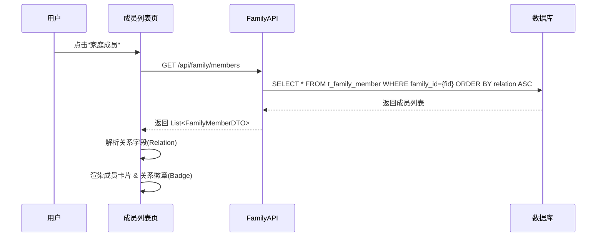
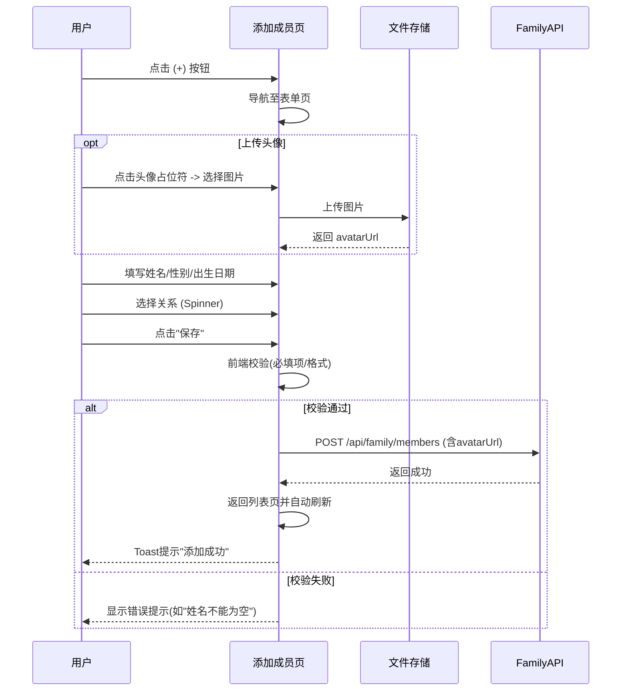
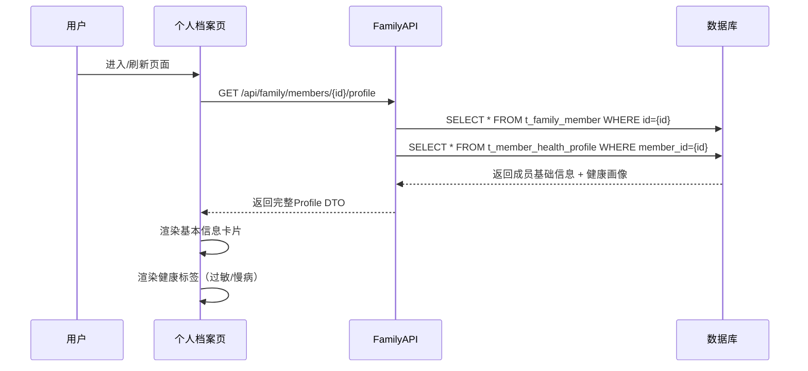
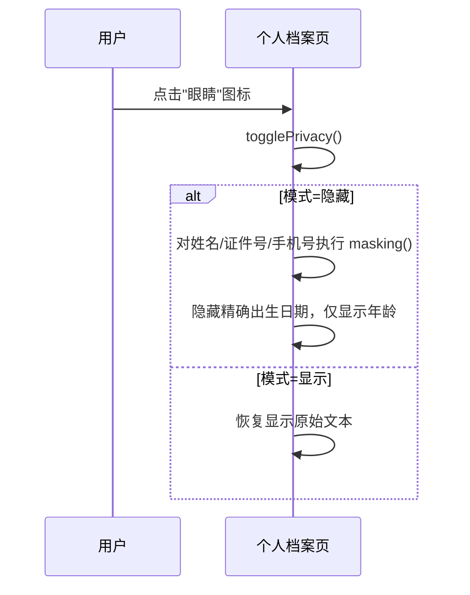
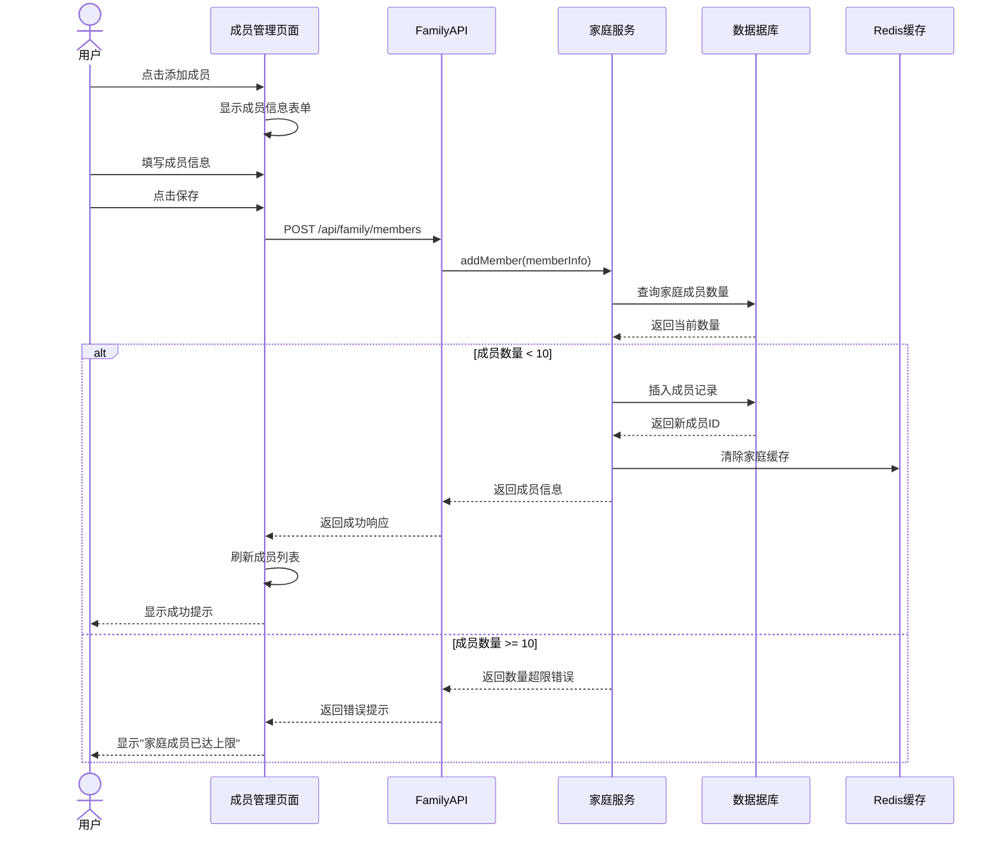
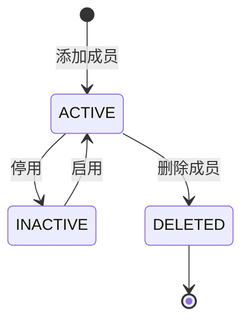
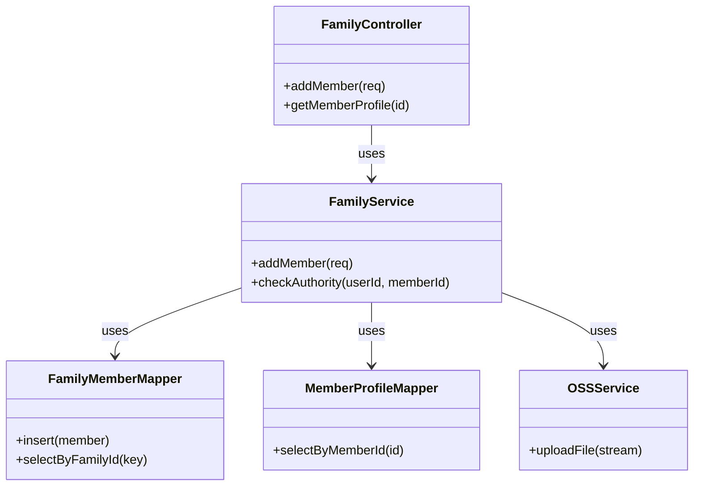
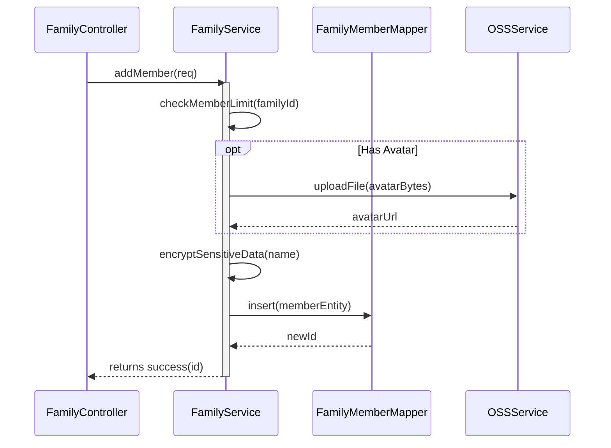

### 3.3 家庭成员管理模块 (F-001)

#### 3.3.1 功能标识

- **功能ID：** F-001
- **功能名称：** 家庭成员管理
- **英文名称：** Family Member Management
- **所属模块：** 基础管理模块
- **版本号：** v1.0

#### 3.3.2 页面原型与交互设计

**1. 家庭成员列表页**


**界面元素：**

| 元素     | 类型                 | 说明                   | 交互行为                        |
| :------- | :------------------- | :--------------------- | :------------------------------ |
| 成员列表 | RecyclerView         | 展示所有成员卡片       | 点击卡片进入"个人档案"          |
| 成员卡片 | CardView             | 含头像、姓名、关系徽章 | 徽章背景色区分关系(如绿色=本人) |
| 添加按钮 | FloatingActionButton | 悬浮于右下角           | 点击跳转"添加成员"页            |

**主要交互 - 加载成员列表：**

*   **交互描述：** 用户进入页面时，系统通过 `family_id` 拉取所有成员，并根据关系优先级（本人 > 配偶 > 子女 > 其他）进行排序展示。
*   **涉及数据结构：** `List<FamilyMemberDTO>`
*   **涉及数据库表：** `t_family_member`
*   **时序图：**



**2. 添加成员页**


**界面元素：**

| 元素     | 类型             | 说明                | 交互行为                 |
| :------- | :--------------- | :------------------ | :----------------------- |
| 头像上传 | ImageView        | 圆形占位符+相机图标 | 点击调用系统相册/相机    |
| 姓名输入 | EditText         | 必填，限制50字符    | 输入时实时校验长度       |
| 性别选择 | ChipGroup        | 单选：男/女         | 点击切换选中状态         |
| 出生日期 | TextView         | 显示"请选择"或日期  | 点击弹出DatePickerDialog |
| 关系选择 | Spinner/Dropdown | 预设关系列表        | 点击弹出选择菜单         |
| 角色开关 | Switch           | 设为管理员          | 切换开关状态             |
| 保存按钮 | Button           | 底部大按钮          | 点击提交表单             |

**主要交互 - 添加成员：**

*   **交互描述：** 用户填写完整信息并点击保存。系统需进行前端校验（必填项、格式），若包含头像则先上传至OSS获取URL，最后提交至后端。
*   **涉及数据结构：** `AddMemberRequest` (含 `avatarUrl`)
*   **涉及数据库表：** `t_family_member`
*   **时序图：**



**3. 个人档案页**


**界面元素：**

| 元素     | 类型         | 说明                      | 交互行为              |
| :------- | :----------- | :------------------------ | :-------------------- |
| 隐私开关 | ToggleButton | 眼睛图标                  | 点击切换脱敏/明文显示 |
| 档案入口 | TabLayout    | 切换"个人档案"/"诊疗记录" | 点击切换Fragment      |
| 概览卡片 | CardView     | 显示BMI/过敏等关键指标    | 点击可跳转编辑        |

**主要交互 1 - 加载档案：**

*   **交互描述：** 进入页面时，同时获取成员基础信息和健康概览信息（身高体重、慢病等）。
*   **涉及数据结构：** `FamilyMember` (含 `HealthInfo`)
*   **涉及数据库表：** `t_family_member`, `t_member_health_profile`
*   **时序图：**



**主要交互 2 - 隐私模式切换：**

*   **交互描述：** 点击小眼睛图标，前端实时切换敏感字段（姓名、证件号）的显示/脱敏状态。
*   **涉及逻辑：** 前端数据掩码工具类
*   **时序图：**



#### 3.3.3 功能概述

**业务价值：** 为家庭提供统一的成员管理能力，支持多家庭成员的健康数据集中管理和共享权限控制。

**主要用户：**
- 家庭管理员
- 家庭成员

**系统定位：** 系统的基础功能，所有健康数据管理的起点。

**前置条件：**
- 用户已完成注册登录
- 用户已创建家庭或被邀请加入家庭

**后置结果：**
- 家庭成员信息录入系统
- 成员间数据共享权限配置完成

#### 3.3.4 原始需求

**需求来源：** 需求规格说明书 3.1 章节

**需求描述：**
> 家庭管理员可以添加新的家庭成员到家庭病历本中，支持输入成员姓名、性别、出生日期、关系等基本信息，支持上传成员头像，支持设置成员角色（家庭成员或家庭管理员），支持设置成员权限。一个家庭最多支持10个成员。

**相关需求：**
- F-002：病历文书导入（需关联到具体成员）
- F-006：数据共享设置

#### 3.3.5 正常流程

**文字描述：**

1. 用户进入家庭成员管理页面
2. 点击"添加成员"按钮
3. 填写成员基本信息（姓名、性别、出生日期、关系）
4. 设置成员角色（家庭管理员/家庭成员）
5. 设置数据访问权限
6. 上传成员头像（可选）
7. 点击"保存"按钮
8. 前端调用 POST /api/family/members 接口
9. 后端验证参数完整性和合法性
10. 检查家庭成员数量限制（最多10人）
11. 保存成员信息到数据库
12. 返回成功响应
13. 前端显示成功提示并刷新成员列表

**序列图：**



#### 3.3.6 异常流程

| 异常场景     | 触发条件               | 系统行为    | 用户提示                               |
| ------------ | ---------------------- | ----------- | -------------------------------------- |
| 姓名为空     | 必填字段未填写         | 返回400错误 | 请输入成员姓名                         |
| 出生日期无效 | 日期格式错误或未来日期 | 返回400错误 | 请输入有效的出生日期                   |
| 成员数量超限 | 家庭成员数≥10          | 返回403错误 | 家庭成员已达上限（10人），无法继续添加 |
| 头像文件过大 | 文件>5MB               | 返回400错误 | 头像文件大小不能超过5MB                |
| 头像格式错误 | 非图片格式             | 返回400错误 | 仅支持JPG、PNG格式图片                 |
| 网络超时     | 请求超过30秒           | 自动重试3次 | 网络连接超时，请检查网络               |
| 未登录       | Token过期              | 跳转登录页  | 登录已过期，请重新登录                 |

#### 3.3.7 状态转换

| 状态     | 说明     | 可执行操作         |
| -------- | -------- | ------------------ |
| ACTIVE   | 正常状态 | 查看档案、导入病历 |
| INACTIVE | 停用状态 | 仅查看，不能操作   |
| DELETED  | 已删除   | 无操作             |



#### 3.3.8 输入数据

**数据来源：** 用户输入表单

**数据格式：**
```json
{
  "name": "string",           // 姓名，必填，1-50字符
  "gender": "MALE|FEMALE",    // 性别，必填
  "birthDate": "YYYY-MM-DD",  // 出生日期，必填
  "relation": "string",       // 关系，必填（本人、配偶、父亲、母亲、子女等）
  "role": "ADMIN|MEMBER",     // 角色，必填
  "avatar": "base64_string",  // 头像，可选
  "permissions": {
    "viewAll": boolean,       // 是否可查看所有人数据
    "editAll": boolean        // 是否可编辑所有人数据
  }
}
```

**校验规则：**
| 字段      | 校验规则             | 错误提示             |
| --------- | -------------------- | -------------------- |
| name      | 非空，1-50字符       | 姓名长度为1-50个字符 |
| gender    | 必选MALE或FEMALE     | 请选择性别           |
| birthDate | 非空，不晚于当前日期 | 出生日期不能晚于今天 |
| relation  | 非空                 | 请选择与成员的关系   |

#### 3.3.9 输出数据

**成功响应：**
```json
{
  "code": 200,
  "message": "添加成功",
  "data": {
    "memberId": "10001",
    "name": "张三",
    "gender": "MALE",
    "birthDate": "1980-01-01",
    "relation": "本人",
    "role": "ADMIN",
    "avatar": "https://cdn.example.com/avatar/10001.jpg",
    "permissions": {
      "viewAll": true,
      "editAll": true
    },
    "createTime": "2024-01-15T10:30:00Z"
  }
}
```

**失败响应：**
```json
{
  "code": 400,
  "message": "参数校验失败",
  "data": {
    "field": "name",
    "error": "姓名不能为空"
  }
}
```

#### 3.3.10 类设计

**1. API Layer (Controller/Router)**

- **FamilyController**: 家庭成员管理接口控制器。
  - `addMember()`: 添加家庭成员。
  - `getMembers()`: 获取家庭成员列表。
  - `updateMember()`: 更新成员信息。
  - `deleteMember()`: 删除成员。
  - **Router Definition**:
    ```java
    @RestController
    @RequestMapping("/api/family/members")
    public class FamilyController {
        @PostMapping
        public Result<Long> addMember(@RequestBody @Valid AddMemberRequest request);
        
        @GetMapping
        public Result<List<FamilyMemberDTO>> getMembers(@RequestParam(required = false) Long familyId);
        
        @GetMapping("/{id}")
        public Result<MemberProfileDTO> getMemberProfile(@PathVariable Long id);
    }
    ```

**2. Service Layer**

- **FamilyService**: 业务逻辑实现。
  - `addMember`: 校验成员数量上限 (<10)，加密敏感字段，保存数据。
  - `checkAuthority`: 校验操作人是否有权限查看/编辑目标成员数据。
  - **Dependencies**: `OSSService` (Avatar upload).

**3. Data Access Layer**

- **FamilyMemberMapper**: 访问 `t_family_member` 表。
  - `insert(FamilyMember member)`
  - `selectByFamilyId(Long familyId)`
  - `countByFamilyId(Long familyId)`
- **MemberProfileMapper**: 访问 `t_member_health_profile` 表。
  - `selectByMemberId(Long memberId)`

**4. External Services**

- **OSSService**: 文件存储抽象服务。
  - `uploadFile(InputStream is, String fileName)`
- **RedisService**: 缓存服务。
  - `evictCache(String key)`

**5. Model Layer**

- **entity.FamilyMember**: 对应 `t_family_member` 表。
- **dto.AddMemberRequest**: 添加成员请求体。
- **dto.MemberProfileDTO**: 成员档案详情DTO。

**6. 静态结构图 (Class Diagram)**



**7. 类协作图 (Collaboration Diagram)**

展示 `addMember` (添加家庭成员) 的内部协作。




#### 3.3.11 数据库详细设计

**Table: t_family_member (家庭成员表)**

```sql
CREATE TABLE `t_family_member` (
  `id` bigint(20) NOT NULL AUTO_INCREMENT COMMENT '主键ID',
  `family_id` bigint(20) NOT NULL COMMENT '家庭ID',
  `user_id` bigint(20) DEFAULT NULL COMMENT '关联用户ID (若该成员也是系统用户)',
  `name` varchar(255) NOT NULL COMMENT '成员姓名 (加密存储)',
  `gender` tinyint(4) NOT NULL COMMENT '性别：1-男，2-女',
  `birth_date` date NOT NULL COMMENT '出生日期',
  `relation` varchar(20) NOT NULL COMMENT '与户主关系 (SELF, SPOUSE, CHILD, PARENT, OTHER)',
  `role` tinyint(4) NOT NULL DEFAULT '2' COMMENT '角色：1-管理员，2-普通成员',
  `avatar_url` varchar(500) DEFAULT NULL COMMENT '头像URL',
  `view_all` tinyint(1) NOT NULL DEFAULT '0' COMMENT '权限：是否可查看所有人数据',
  `edit_all` tinyint(1) NOT NULL DEFAULT '0' COMMENT '权限：是否可编辑所有人数据',
  `status` tinyint(4) NOT NULL DEFAULT '1' COMMENT '状态：1-正常，2-停用，3-删除',
  `create_time` datetime NOT NULL DEFAULT CURRENT_TIMESTAMP COMMENT '创建时间',
  `update_time` datetime NOT NULL DEFAULT CURRENT_TIMESTAMP ON UPDATE CURRENT_TIMESTAMP COMMENT '更新时间',
  PRIMARY KEY (`id`),
  KEY `idx_family_id` (`family_id`) USING BTREE COMMENT '通过家庭ID查询',
  KEY `idx_user_id` (`user_id`) USING BTREE
) ENGINE=InnoDB DEFAULT CHARSET=utf8mb4 COMMENT='家庭成员表';
```

**Table: t_member_health_profile (成员健康基础档案表)**

```sql
CREATE TABLE `t_member_health_profile` (
  `member_id` bigint(20) NOT NULL COMMENT '成员ID (FK)',
  `height` decimal(5,2) DEFAULT NULL COMMENT '身高(cm)',
  `weight` decimal(5,2) DEFAULT NULL COMMENT '体重(kg)',
  `blood_type` varchar(10) DEFAULT NULL COMMENT '血型 (A, B, AB, O, OTHER)',
  `allergies` json DEFAULT NULL COMMENT '过敏史列表 (JSON array)',
  `chronic_diseases` json DEFAULT NULL COMMENT '慢性病列表 (JSON array)',
  `update_time` datetime NOT NULL DEFAULT CURRENT_TIMESTAMP ON UPDATE CURRENT_TIMESTAMP COMMENT '最后更新时间',
  PRIMARY KEY (`member_id`),
  CONSTRAINT `fk_profile_member` FOREIGN KEY (`member_id`) REFERENCES `t_family_member` (`id`) ON DELETE CASCADE
) ENGINE=InnoDB DEFAULT CHARSET=utf8mb4 COMMENT='成员健康基础档案表';
```

#### 3.3.12 接口定义

**1. 添加家庭成员**

- **URL**: `/api/family/members`
- **Method**: `POST`
- **Content-Type**: `application/json`
- **Authentication**: Bearer Token required

**Request Body:**

```json
{
  "name": "张三",
  "gender": "MALE",
  "birthDate": "1990-01-01",
  "relation": "SELF",
  "role": "ADMIN",
  "avatarUrl": "https://oss.example.com/avatars/temp_123.jpg",
  "permissions": {
    "viewAll": true,
    "editAll": true
  }
}
```

**Response Body (Success):**

```json
{
  "code": 200,
  "message": "添加成功",
  "data": {
    "memberId": "10086",
    "createTime": "2024-01-25 10:00:00"
  }
}
```

**2. 获取家庭成员列表**

- **URL**: `/api/family/members`
- **Method**: `GET`
- **Query Params**:
  - `familyId` (Optional): ID of family, defaults to current user's family.

**Response Body:**

```json
{
  "code": 200,
  "data": [
    {
      "memberId": "10086",
      "name": "张三",
      "relation": "SELF",
      "avatarUrl": "...",
      "role": "ADMIN"
    },
    ...
  ]
}
```

---