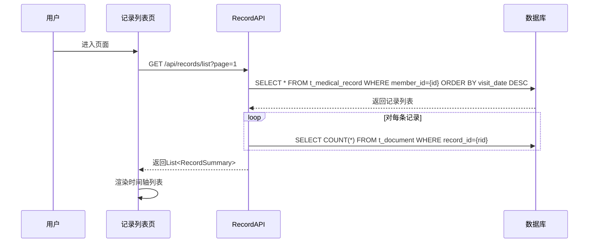
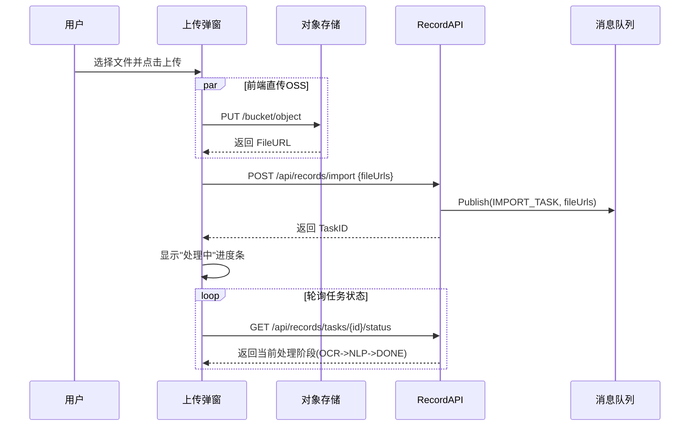
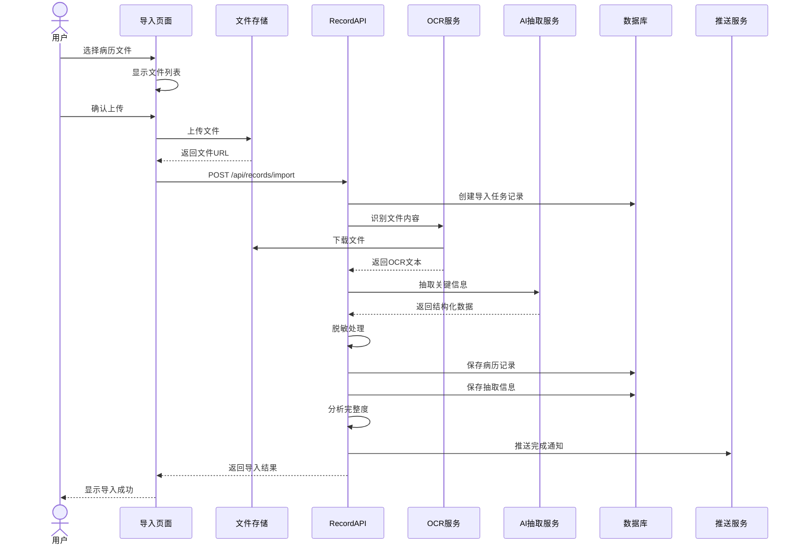
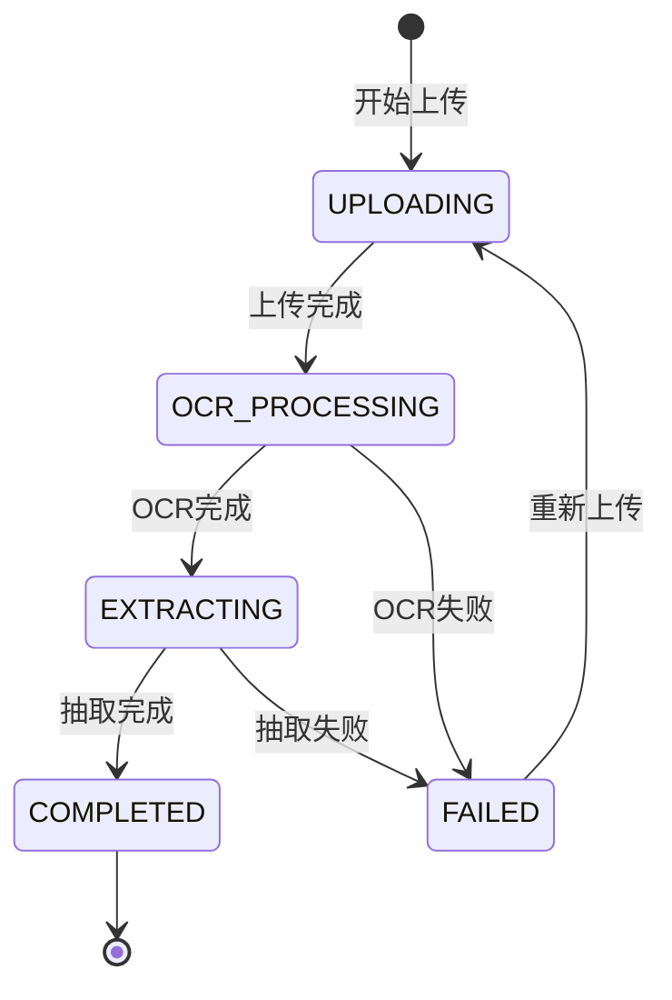
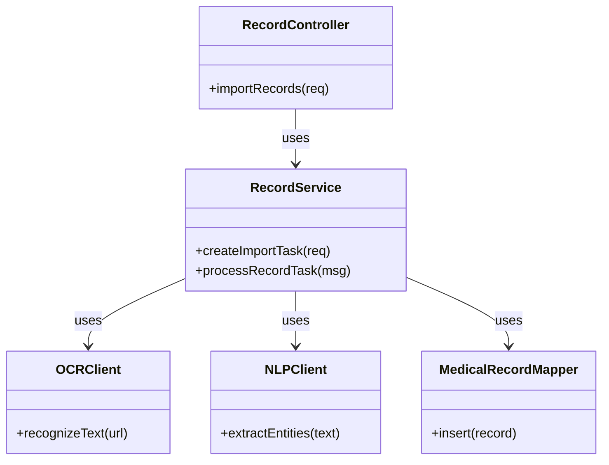
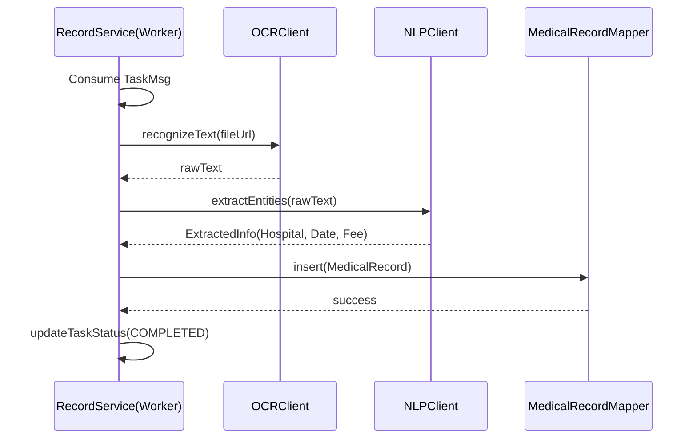

---

### 3.4 病历文书导入模块 (F-002)

#### 3.4.1 功能标识

- **功能ID：** F-002
- **功能名称：** 病历文书导入
- **英文名称：** Medical Record Import
- **所属模块：** 健康档案模块
- **版本号：** v1.0

#### 3.4.2 页面原型与交互设计

**1. 导入/病历列表页**


**界面元素：**

| 元素         | 说明                    |
| :----------- | :---------------------- |
| 文件选择区   | 支持点击或拖拽上传      |
| 拍照上传     | 调用相机拍照            |
| 文件列表     | 显示已选文件，支持删除  |
| 上传按钮     | 开始上传并解析          |
| 处理进度     | 显示每个文件的处理状态  |
| 自动处理说明 | 列出OCR、抽取、脱敏功能 |

**主要交互 - 导入/病历列表加载：**

*   **交互描述：** 用户查看记录列表或进入导入页查看任务。
*   **涉及数据结构：** `List<RecordSummary>`
*   **涉及数据库表：** `t_medical_record`, `t_document`
*   **时序图：**



**2. 上传弹窗**


**主要交互 - 触发病历上传：**

*   **交互描述：** 用户选择文件/拍照后，点击上传。系统执行前端直传OSS，随后后端创建异步解析任务（OCR+NLP）。
*   **涉及数据结构：** `ImportTask`
*   **涉及数据库表：** `t_document` (暂存), `MQ` (任务)
*   **时序图：**



**智能识别流程：**
1. **多模态上传：** 支持拍照（含裁剪旋转）和文件选择（多选PDF/图片）。
2. **智能解析反馈：** 实时进度条显示OCR/NLP状态；完成后自动生成摘要（医院、科室、时间）并标记完成。

#### 3.4.3 功能概述

**业务价值：** 实现病历文书的数字化导入，为后续的信息抽取、档案管理提供数据基础。

**主要用户：**
- 家庭管理员
- 家庭成员

**系统定位：** 健康档案管理的核心入口功能。

**前置条件：**
- 已选择要导入的目标家庭成员
- 用户已登录

**后置结果：**
- 病历文书文件上传成功
- OCR识别完成
- 信息抽取完成
- 档案记录生成

#### 3.4.4 原始需求

**需求来源：** 需求规格说明书 3.2.1 章节

**需求描述：**
> 用户可以为当前选中的家庭成员导入病历文书（影像件或PDF文件），系统自动识别并提取收费和结算信息。支持导入PDF格式的病历文书，支持导入常见图片格式（JPG、PNG、JPEG）。单次支持导入多个文件（最多10个），文件大小限制：单个文件不超过20MB。

#### 3.4.5 正常流程

**文字描述：**

1. 用户选择当前家庭成员
2. 进入"导入病历"页面
3. 选择上传方式（拍照/选择文件）
4. 选择病历文件（支持多选）
5. 系统显示文件列表和大小
6. 用户确认上传
7. 前端上传文件到OSS
8. 调用后端接口创建导入任务
9. 后端调用OCR服务识别文件内容
10. 后端调用AI服务抽取关键信息
11. 后端进行个人信息脱敏处理
12. 保存抽取结果到数据库
13. 分析材料完整度
14. 返回导入结果
15. 前端显示导入进度和结果

**序列图：**



#### 3.4.6 异常流程

| 异常场景     | 触发条件              | 系统行为     | 用户提示                     |
| ------------ | --------------------- | ------------ | ---------------------------- |
| 文件格式错误 | 非PDF/图片格式        | 拒绝上传     | 仅支持PDF、JPG、PNG格式      |
| 文件过大     | 单文件>20MB           | 拒绝上传     | 文件大小不能超过20MB         |
| 文件数量超限 | 单次>10个             | 拒绝上传     | 单次最多上传10个文件         |
| OCR识别失败  | 文件质量差/格式不支持 | 标记失败     | 文件识别失败，请尝试重新拍摄 |
| 抽取失败     | AI服务异常            | 保存原始文件 | 信息抽取失败，可手动补充     |
| 网络中断     | 上传中断              | 支持断点续传 | 网络中断，已上传文件已保存   |

#### 3.4.7 状态转换



#### 3.4.8 输入数据

```json
{
  "memberId": "string",        // 目标成员ID，必填
  "files": [
    {
      "fileName": "string",    // 文件名
      "fileType": "PDF|JPG|PNG|JPEG",
      "fileSize": number,      // 文件大小（字节）
      "fileUrl": "string",     // OSS URL
      "uploadTime": "string"   // 上传时间
    }
  ],
  "source": "HOSPITAL|SELF"    // 来源
}
```

#### 3.4.9 输出数据

```json
{
  "code": 200,
  "message": "导入任务创建成功",
  "data": {
    "taskId": "TASK_20240115_001",
    "memberId": "10001",
    "fileCount": 3,
    "status": "PROCESSING",
    "estimatedTime": 30,
    "results": [
      {
        "fileName": "门诊病历.pdf",
        "status": "COMPLETED",
        "recordId": "REC_001",
        "completeness": 85,
        "missingDocs": ["费用清单"]
      }
    ]
  }
}
```

#### 3.4.10 类设计

**1. API Layer (Controller/Router)**

- **RecordController**: 病历管理接口控制器。
  - `importRecords()`: 提交导入任务。
  - `getTaskStatus()`: 查询导入进度。
  - `listRecords()`: 分页查询病历列表。
  - **Router Definition**:
    ```java
    @RestController
    @RequestMapping("/api/records")
    public class RecordController {
        @PostMapping("/import")
        public Result<String> importRecords(@RequestBody ImportRequest request);
        
        @GetMapping("/tasks/{taskId}")
        public Result<TaskStatusDTO> getTaskStatus(@PathVariable String taskId);
        
        @GetMapping
        public Result<Page<RecordSummary>> listRecords(@RequestParam Long memberId, Pageable page);
    }
    ```

**2. Service Layer**

- **RecordService**: 核心业务类。
  - `createImportTask()`: 创建异步任务，发送消息到MQ。
  - `processRecordTask()`: 消费者，处理OCR和NLP流程。
- **ImportStrategyFactory**: 导入策略工厂（支持不同文件类型PDF/Image处理）。

**3. AI & External Layer**

- **OCRClient**: OCR服务客户端 (e.g. Aliyun OCR / Tesseract)。
  - `recognizeText(String fileUrl): String`
- **NLPClient**: 自然语言处理客户端 (LLM/Bert)。
  - `extractEntities(String text): ExtractedInfo`
  - `anonymize(String text): String` (脱敏)

**4. Data Access Layer**

- **MedicalRecordMapper**: 访问 `t_medical_record`。
- **DocumentMapper**: 访问 `t_document` (原始文件表)。
- **TaskRepository**: 访问 Redis/DB 获取任务状态。

**5. Model Layer**

- **entity.MedicalRecord**: 病历实体。
- **dto.ImportRequest**: 导入请求。
- **dto.ExtractedInfo**: 抽取结果结构体。

**6. 静态结构图 (Class Diagram)**



**7. 类协作图 (Collaboration Diagram)**

展示 `processRecordTask` (后台异步处理) 的内部协作。




```java
public interface RecordService {
    /**
     * 创建导入任务
     * @return 任务ID
     */
    String createImportTask(ImportRequest request);

    /**
     * 查询任务状态
     */
    ImportTaskStatus getTaskStatus(String taskId);

    /**
     * 保存解析结果
     */
    void saveRecord(MedicalRecord record, List<Document> docs);
}
```

#### 3.4.11 数据库详细设计

**Table: t_medical_record (病历记录表)**

```sql
CREATE TABLE `t_medical_record` (
  `id` bigint(20) NOT NULL AUTO_INCREMENT COMMENT '主键ID',
  `member_id` bigint(20) NOT NULL COMMENT '成员ID',
  `family_id` bigint(20) NOT NULL COMMENT '家庭ID',
  `record_type` tinyint(4) NOT NULL COMMENT '类型：1-门诊，2-住院，3-体检',
  `hospital_name` varchar(100) DEFAULT NULL COMMENT '医院名称',
  `department` varchar(50) DEFAULT NULL COMMENT '科室',
  `doctor_name` varchar(50) DEFAULT NULL COMMENT '医生姓名',
  `visit_date` date DEFAULT NULL COMMENT '就诊日期',
  `main_diagnosis` text COMMENT '主要诊断',
  `completeness` int(11) NOT NULL DEFAULT '0' COMMENT '完整度百分比',
  `status` tinyint(4) NOT NULL DEFAULT '1' COMMENT '状态：1-正常，2-删除',
  `create_time` datetime NOT NULL DEFAULT CURRENT_TIMESTAMP COMMENT '创建时间',
  `update_time` datetime NOT NULL DEFAULT CURRENT_TIMESTAMP ON UPDATE CURRENT_TIMESTAMP COMMENT '更新时间',
  PRIMARY KEY (`id`),
  KEY `idx_member_visit` (`member_id`,`visit_date`) USING BTREE COMMENT '成员就诊记录索引',
  KEY `idx_family_id` (`family_id`) USING BTREE
) ENGINE=InnoDB DEFAULT CHARSET=utf8mb4 COMMENT='病历记录表';
```

**Table: t_document (病历文书表)**

```sql
CREATE TABLE `t_document` (
  `id` bigint(20) NOT NULL AUTO_INCREMENT COMMENT '主键ID',
  `record_id` bigint(20) NOT NULL COMMENT '关联病历记录ID',
  `doc_type` varchar(50) NOT NULL COMMENT '文书类型 (如: 处方单, 检查报告)',
  `file_format` varchar(10) NOT NULL COMMENT '文件格式 (PDF, JPG)',
  `file_url` varchar(500) NOT NULL COMMENT '文件存储URL',
  `masked_url` varchar(500) DEFAULT NULL COMMENT '脱敏后文件URL',
  `ocr_status` tinyint(4) NOT NULL DEFAULT '0' COMMENT 'OCR状态：0-待处理，1-成功，2-失败',
  `extract_status` tinyint(4) NOT NULL DEFAULT '0' COMMENT '抽取状态：0-待处理，1-成功，2-失败',
  `file_size` bigint(20) NOT NULL COMMENT '文件大小（字节）',
  `upload_time` datetime NOT NULL DEFAULT CURRENT_TIMESTAMP COMMENT '上传时间',
  PRIMARY KEY (`id`),
  KEY `idx_record_id` (`record_id`) USING BTREE
) ENGINE=InnoDB DEFAULT CHARSET=utf8mb4 COMMENT='病历文书表';
```

#### 3.4.12 接口定义

**1. 创建病历导入任务**

- **URL**: `/api/records/import`
- **Method**: `POST`
- **Content-Type**: `application/json`

**Request Body:**

```json
{
  "memberId": "10086",
  "files": [
    {
      "fileName": "report.pdf",
      "fileUrl": "https://oss.../report.pdf",
      "fileSize": 102400,
      "fileType": "PDF"
    }
  ]
}
```

**Response Body:**

```json
{
  "code": 200,
  "data": {
    "taskId": "TASK_123456",
    "status": "QUEUED"
  }
}
```

**2. 查询任务状态**

- **URL**: `/api/records/tasks/{taskId}/status`
- **Method**: `GET`

**Response Body:**

```json
{
  "code": 200,
  "data": {
    "taskId": "TASK_123456",
    "status": "PROCESSING",
    "progress": 50,
    "currentStep": "OCR_RECOGNITION"
  }
}
```

**3. 获取病历列表**

- **URL**: `/api/records/list`
- **Method**: `GET`
- **Query Params**:
  - `memberId`: required
  - `page`: default 1
  - `pageSize`: default 20

**Response Body:**

```json
{
  "code": 200,
  "data": {
    "total": 10,
    "list": [
      {
        "id": "REC_001",
        "hospitalName": "第一人民医院",
        "visitDate": "2024-01-01",
        "docCount": 3
      }
    ]
  }
}
```

---