# 家庭病历本 详细设计说明书


**运行环境：** Android 8.0及以上系统


## 2. 总体设计

### 2.1 需求规定

系统主要功能需求包括：

1. **家庭成员管理**：添加、编辑、删除家庭成员，设置家庭管理员，管理数据共享权限
2. **健康档案管理**：病历文书导入、内容抽取、信息脱敏、档案更新、信息检索
3. **检查报告解读**：单一报告解读、多次报告对比、异常指标展示、趋势分析
4. **用药助手**：服药规划、智能提醒、用药安全监控
5. **生活管理**：运动处方、饮食处方、复诊提醒

### 2.2 运行环境

**客户端环境：**
- 操作系统：Android 8.0（API 26）及以上
- 目标SDK：API 34（Android 14）

**服务端环境：**
- 操作系统：Linux（CentOS 7.x/8.x或Ubuntu 18.04/20.04）
- 应用服务器：Node.js 18.x / Java 17
- 数据库：MySQL 8.0 / PostgreSQL 13.x
- 缓存：Redis 6.x
- 消息队列：RabbitMQ 3.x

### 2.3 基本设计概念和处理流程

#### 2.3.1 设计原则

1.  **隐私优先 (Privacy First)**：所有敏感健康数据（PHI）必须脱敏存储，数据在传输和存储过程中必须加密。用户对自己的数据拥有完全的控制权和授权机制。
2.  **AI 驱动 (AI-Driven)**：系统深度集成 OCR、NLP 和 LLM 技术，最大限度降低用户的数据录入成本，提升数据的结构化程度。
3.  **以家庭为单位 (Family-Centric)**：区别于传统的个人健康App，本系统强化"家庭"概念，支持多成员管理、代管功能和家庭内数据共享。
4.  **模块化设计 (Modularity)**：采用高内聚低耦合的模块化设计，各业务模块（如用药、运功、饮食）可独立演进。

#### 2.3.2 核心业务流程

**1. 健康数据闭环流程**

用户通过多种方式录入数据，经由系统处理生成结构化档案，AI分析后形成健康建议，用户执行建议产生新的数据，形成闭环。

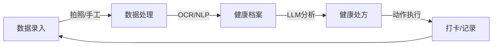
```mermaid
graph LR
    Input[数据录入] -->|拍照/手工| Process[数据处理]
    Process -->|OCR/NLP| Profile[健康档案]
    Profile -->|LLM分析| Plan[健康处方]
    Plan -->|动作执行| Action[打卡/记录]
    Action --> Input
```

**2. 离线/在线混合处理流程**

为保证体验，系统采用"端侧预处理 + 云端深度计算"的混合模式。

*   **实时交互**：简单的格式校验、图片裁剪、本地缓存读写在客户端完成，响应迅速。
*   **重计算任务**：OCR识别、病历结构化抽取、复杂报告解读在云端异步进行，通过消息队列解耦，计算完成后异步通知客户端。

### 2.4 结构

#### 2.4.1 系统架构图

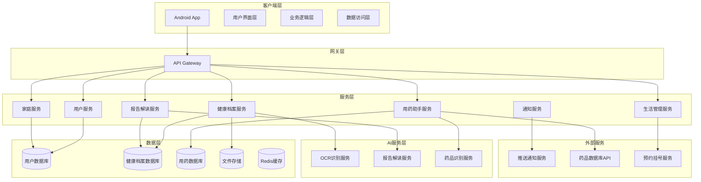
```mermaid
graph TB
    subgraph "客户端层"
        A[Android App]
        A1[用户界面层]
        A2[业务逻辑层]
        A3[数据访问层]
    end

    subgraph "网关层"
        G[API Gateway]
    end

    subgraph "服务层"
        S1[用户服务]
        S2[家庭服务]
        S3[健康档案服务]
        S4[报告解读服务]
        S5[用药助手服务]
        S6[生活管理服务]
        S7[通知服务]
    end

    subgraph "AI服务层"
        AI1[OCR识别服务]
        AI2[报告解读服务]
        AI3[药品识别服务]
    end

    subgraph "数据层"
        D1[(用户数据库)]
        D2[(健康档案数据库)]
        D3[(用药数据库)]
        D4[(文件存储)]
        D5[(Redis缓存)]
    end

    subgraph "外部服务"
        E1[推送通知服务]
        E2[药品数据库API]
        E3[预约挂号服务]
    end

    A --> G
    G --> S1
    G --> S2
    G --> S3
    G --> S4
    G --> S5
    G --> S6

    S3 --> AI1
    S4 --> AI2
    S5 --> AI3

    S1 --> D1
    S2 --> D1
    S3 --> D2
    S4 --> D2
    S5 --> D3
    S3 --> D4

    S7 --> E1
    S5 --> E2
    S6 --> E3
```

#### 2.4.2 技术架构

| 层次     | 技术选型                 | 说明               |
| -------- | ------------------------ | ------------------ |
| 客户端   | Kotlin + MVVM            | Android原生开发    |
| UI框架   | Jetpack Compose          | 现代化声明式UI     |
| 网络库   | Retrofit + OkHttp        | HTTP客户端         |
| 图片加载 | Coil                     | Kotlin协程图片加载 |
| 依赖注入 | Hilt                     | 依赖注入框架       |
| 数据库   | Room                     | 本地SQLite封装     |
| 异步处理 | Kotlin Coroutines + Flow | 协程与数据流       |
| 服务端   | Node.js / Spring Boot    | RESTful API        |
| 数据库   | MySQL 8.0 / PostgreSQL   | 关系型数据库       |
| 缓存     | Redis                    | 分布式缓存         |
| 文件存储 | MinIO / OSS              | 对象存储           |

#### 2.4.3 系统文件夹结构设计

**1. Android 客户端项目结构 (MVVM + Clean Architecture)**

```text
com.unisound.medical.health
├── app
│   ├── api                       // Retrofit API Interfaces
│   │   ├── HomeApi.kt              // 首页相关接口
│   │   ├── FamilyApi.kt            // 家庭成员相关接口
│   │   ├── RecordApi.kt            // 病历相关接口
│   │   └── ReportApi.kt            // 报告相关接口
│   ├── di                        // Dependency Injection
│   │   ├── NetworkModule.kt        // OkHttp/Retrofit Provider
│   │   └── ServiceModule.kt        // Service Binding
│   ├── model                     // Data Class
│   │   ├── entity                  // Room Database Entities
│   │   └── dto                     // Network Response DTOs
│   ├── repository                // Repository (Data Source Arbitration)
│   │   ├── FamilyRepository.kt
│   │   └── HealthRepository.kt
│   ├── ui                        // Jetpack Compose Screens
│   │   ├── home                    // [3.2 系统首页]
│   │   │   └── HomeScreen.kt
│   │   ├── family                  // [3.3 家庭成员]
│   │   │   ├── FamilyListScreen.kt
│   │   │   └── AddMemberScreen.kt
│   │   ├── health                  // [3.4 病历导入]
│   │   │   ├── RecordListScreen.kt
│   │   │   └── UploadRecordDialog.kt
│   │   ├── report                  // [3.5 报告解读]
│   │   │   ├── ReportDetailScreen.kt
│   │   │   └── TrendChartScreen.kt
│   │   ├── medication              // [3.6 用药助手]
│   │   │   └── DailyMedicationScreen.kt
│   │   └── lifestyle               // [3.7 生活管理]
│   │       └── PrescriptionScreen.kt
│   └── viewmodel                 // Jetpack ViewModels
│       ├── HomeViewModel.kt
│       ├── FamilyViewModel.kt
│       └── ...
└── core                          // Shared Components
    ├── BaseScreen.kt
    └── Result.kt
```

**2. 后端服务端项目结构 (Spring Boot - DDD分层风格)**

```text
com.unisound.medical.backend
├── common                            // 公共基础库
│   ├── result/Result.java              // 统一响应
│   ├── exception/GlobalHandler.java    // 异常拦截
│   └── util/                         // DateUtil, SecurityUtil
├── config                            // 全局配置
│   ├── SwaggerConfig.java
│   └── MybatisPlusConfig.java
├── modules                           // 业务模块 [基于Section 3分类]
│   ├── home                          // [3.2 系统首页]
│   │   ├── controller/HomeController.java
│   │   └── service/DashboardService.java
│   ├── family                        // [3.3 家庭成员]
│   │   ├── controller/FamilyController.java
│   │   ├── service/FamilyService.java
│   │   └── mapper/FamilyMemberMapper.java
│   ├── health                        // [3.4 病历导入]
│   │   ├── controller/RecordController.java
│   │   ├── service/RecordService.java
│   │   └── mapper/MedicalRecordMapper.java
│   ├── report                        // [3.5 报告解读]
│   │   ├── controller/ReportController.java
│   │   ├── service/ReportService.java
│   │   ├── service/impl/InterpretationEngine.java
│   │   └── mapper/LabReportMapper.java
│   ├── medication                    // [3.6 用药助手]
│   │   ├── controller/MedicationController.java
│   │   ├── service/MedicationService.java
│   │   ├── service/SafetyService.java
│   │   └── mapper/MedicationMapper.java
│   └── lifestyle                     // [3.7 生活管理]
│       ├── controller/LifestyleController.java
│       ├── service/LifestyleService.java
│       ├── service/PlanGeneratorService.java
│       └── service/impl/RecommendationEngine.java
├── client                            // 外部服务调用 (Feign/Http)
│   ├── AIClient.java                   // OCR/NLP/LLM 统一入口
│   ├── OSSClient.java                  // 文件上传
│   └── DrugKnowledgeClient.java        // 药品知识库
└── DailyHealthApplication.java
```

#### 2.4.4 系统公共代码设计

**1. 统一响应封装 (Result Wrapper)**

所有后端接口统一返回 `Result<T>` 结构，确保前后端交互协议一致。

```java
public class Result<T> {
    private Integer code;   // 状态码 (200=成功, 500=错误)
    private String message; // 提示信息
    private T data;         // 业务数据
    
    public static <T> Result<T> success(T data) { ... }
    public static <T> Result<T> error(int code, String msg) { ... }
}
```

**2. 客户端基类设计 (Base Classes)**

- **BaseViewModel**: 处理通用的加载状态 (`isLoading`)、错误处理 (`uiEvent`) 和协程作用域。
- **BaseScreen**: Compose页面的通用脚手架，包含 `Scaffold`、顶部栏处理和统一的 `Snackbar` 宿主。

**3. 全局异常处理 (Global Exception Handling)**

- **GlobalExceptionHandler (Backend)**:
  - `@ExceptionHandler(BusinessException.class)`: 捕获业务异常，返回对应错误码。
  - `@ExceptionHandler(Exception.class)`: 捕获未预知异常，返回 "系统内部错误"。

**4. 常用工具类 (Utils)**

- **DateUtil**: 日期格式化、年龄计算 (根据出生日期)。
- **SecurityUtil**: 数据脱敏 (手机号中间4位、身份证掩码)、加密解密。
- **FileUtil**: 文件类型校验、大小检查、MIME类型获取。


### 2.5 功能需求与程序的关系

| 功能模块     | 功能ID | 前端模块           | 后端服务            | 数据表                        |
| ------------ | ------ | ------------------ | ------------------- | ----------------------------- |
| 系统首页     | F-000  | HomeDashboard      | DashboardService    | t_family_member, t_daily_goal |
| 家庭成员管理 | F-001  | FamilyManager      | FamilyService       | t_family, t_member            |
| 病历文书导入 | F-002  | RecordUpload       | RecordService       | t_medical_record, t_document  |
| 个人信息脱敏 | F-003  | PrivacyView        | OCRService          | t_document                    |
| 内容自动抽取 | F-004  | ExtractService     | AIService           | t_extracted_info              |
| 健康档案更新 | F-005  | ProfileEditor      | RecordService       | t_member_profile              |
| 诊疗记录管理 | F-006  | VisitRecordList    | RecordService       | t_visit_record                |
| 档案信息检索 | F-007  | RecordSearch       | RecordService       | t_visit_record                |
| 档案统计     | F-008  | RecordStats        | RecordService       | t_medical_record              |
| 报告单一解读 | F-009  | ReportDetail       | ReportService       | t_lab_report                  |
| 报告多次对比 | F-010  | ReportCompare      | ReportService       | t_lab_report                  |
| 异常指标展示 | F-011  | AbnormalList       | ReportService       | t_lab_report                  |
| 趋势分析     | F-012  | TrendAnalysis      | ReportService       | t_lab_report                  |
| 行动清单生成 | F-013  | ActionList         | ReportService       | t_action_item                 |
| 服药规划     | F-014  | MedicationPlan     | MedicationService   | t_medication                  |
| 智能服药提醒 | F-015  | MedicationReminder | NotificationService | t_medication_schedule         |
| 用药安全监控 | F-016  | SafetyCheck        | MedicationService   | t_allergy, t_drug_interaction |
| 运动处方     | F-017  | ExercisePlan       | LifestyleService    | t_exercise_plan               |
| 饮食处方     | F-018  | DietPlan           | LifestyleService    | t_diet_plan                   |
| 复诊计划     | F-019  | FollowUpPlan       | LifestyleService    | t_follow_up                   |

---

## 3. 功能模块详细设计

### 3.1 功能模块概览

#### 功能模块结构图


```mermaid
graph TD
    Root[家庭病历本系统功能模块]

    %% 基础管理
    Root --> Module1[基础管理模块]
    Module1 --> F001[F-001 家庭成员管理]

    %% 健康档案
    Root --> Module2[健康档案模块]
    Module2 --> F002[F-002 病历文书导入]
    Module2 --> F003[F-003 个人信息脱敏]
    Module2 --> F004[F-004 内容自动抽取]
    Module2 --> F005[F-005 健康档案更新]
    Module2 --> F006[F-006 诊疗记录管理]
    Module2 --> F007[F-007 档案信息检索]
    Module2 --> F008[F-008 档案统计]

    %% 报告解读
    Root --> Module3[报告解读模块]
    Module3 --> F009[F-009 报告单一解读]
    Module3 --> F010[F-010 报告多次对比]
    Module3 --> F011[F-011 异常指标展示]
    Module3 --> F012[F-012 趋势分析]
    Module3 --> F013[F-013 行动清单生成]

    %% 用药助手
    Root --> Module4[用药助手模块]
    Module4 --> F014[F-014 服药规划]
    Module4 --> F015[F-015 智能服药提醒]
    Module4 --> F016[F-016 用药安全监控]

    %% 生活管理
    Root --> Module5[生活管理模块]
    Module5 --> F017[F-017 运动处方]
    Module5 --> F018[F-018 饮食处方]
    Module5 --> F019[F-019 复诊计划]
    
    classDef module fill:#e1f5fe,stroke:#01579b,stroke-width:2px;
    classDef func fill:#f3e5f5,stroke:#4a148c,stroke-width:1px;
    
    class Module1,Module2,Module3,Module4,Module5 module;
    class F001,F002,F003,F004,F005,F006,F007,F008,F009,F010,F011,F012,F013,F014,F015,F016,F017,F018,F019 func;
```

### 3.2 系统首页 (F-000)

#### 3.2.1 功能标识

- **功能ID：** F-000
- **功能名称：** 系统首页 (仪表盘)
- **英文名称：** System Home Dashboard
- **所属模块：** 基础框架
- **版本号：** v1.0

#### 3.2.2 页面原型与交互设计

**1. 系统首页**


**界面元素：**

| 元素         | 类型         | 说明                          | 交互行为                  |
| :----------- | :----------- | :---------------------------- | :------------------------ |
| 顶部问候语   | TextView     | 显示"上午好/下午好，[姓名]"   | 无                        |
| 快捷入口     | GridView     | 核心功能入口 (扫药盒、拍病历) | 点击跳转对应功能详情页    |
| 健康摘要卡片 | CardView     | 显示今日运动、服药进度        | 点击跳转生活管理/用药助手 |
| 最近动态     | RecyclerView | 显示最近的复诊提醒、报告更新  | 点击跳转对应记录详情      |
| 底部导航栏   | BottomNav    | 全局导航 (首页、档案、我的)   | 点击切换主模块            |

**主要交互 - 首页数据加载：**

*   **交互描述：** 用户打开App进入首页，系统并发拉取用户信息、今日任务进度、最近通知等数据聚合显示。
*   **涉及数据结构：** `HomeDashboardDTO`
*   **涉及数据库表：** `t_family_member`, `t_daily_goal`, `t_notification`, `t_medication_schedule`
*   **时序图：**

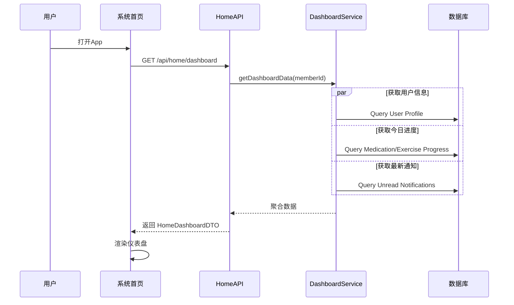
```mermaid
sequenceDiagram
    participant User as 用户
    participant UI as 系统首页
    participant API as HomeAPI
    participant Svc as DashboardService
    participant DB as 数据库

    User->>UI: 打开App
    UI->>API: GET /api/home/dashboard
    API->>Svc: getDashboardData(memberId)
    
    par 获取用户信息
        Svc->>DB: Query User Profile
    and 获取今日进度
        Svc->>DB: Query Medication/Exercise Progress
    and 获取最新通知
        Svc->>DB: Query Unread Notifications
    end
    
    Svc-->>API: 聚合数据
    API-->>UI: 返回 HomeDashboardDTO
    UI->>UI: 渲染仪表盘
```

#### 3.2.3 功能概述

**业务价值：** 作为系统的总入口，为用户提供一站式的信息概览和快捷操作入口，帮助用户快速了解家庭健康状况并处理待办事项。

**主要用户：**
- 所有用户

#### 3.2.4 原始需求

**需求来源：** 需求规格说明书 2.3 章节

**需求描述：**
> 系统首页应包含快捷功能入口、今日健康任务概览（服药、运动）、近期重要消息提醒（复诊、报告结果）。

#### 3.2.5 正常流程

1. 用户登录 App。
2. 系统加载首页配置和数据。
3. 展示问候语和天气信息（可选）。
4. 展示快捷功能入口图标。
5. 展示今日服药和运动目标的完成进度环。
6. 展示最近的健康动态列表（如：张三的血常规报告已生成）。

#### 3.2.6 异常流程

| 异常场景 | 触发条件     | 系统行为           | 用户提示                 |
| :------- | :----------- | :----------------- | :----------------------- |
| 加载失败 | 网络异常     | 显示骨架屏或重试页 | 网络连接失败，点击重试   |
| 数据为空 | 新用户无数据 | 显示引导页         | 欢迎使用，请添加家庭成员 |

#### 3.2.7 类设计

**1. API Layer (Controller/Router)**

- **HomeController**: 首页聚合接口控制器。
  - `getDashboard()`: 处理首页数据聚合请求，并发调用 Services。
  - **Router Definition (Spring Boot Style)**:
    ```java
    @RestController
    @RequestMapping("/api/home")
    public class HomeController {
        @GetMapping("/dashboard")
        public Result<HomeDashboardDTO> getDashboard(@Min(1) @RequestParam Long memberId);
    }
    ```

**2. Service Layer**

- **DashboardService**: 核心业务类。
  - `getDashboardData(Long memberId)`: 编排获取用户信息、进度、通知的任务。
  - **Dependencies**: `FamilyService`, `MedicationService`, `LifestyleService`, `NotificationService`.

**3. Data Access Layer**

- **DailyGoalMapper**: 访问 `t_daily_goal` 表。
  - `selectByDateAndMember(LocalDate date, Long memberId)`
- **NotificationMapper**: 访问 `t_notification` 表。
  - `selectUnreadCount(Long memberId)`

**4. External Services**

- **WeatherClient**: 对接第三方天气API。
  - `getWeather(String cityCode)`

**5. Model Layer**

- **entity.DailyGoal**: 每日目标实体。
- **dto.HomeDashboardDTO**: 首页聚合数据传输对象。

**6. 静态结构图 (Class Diagram)**

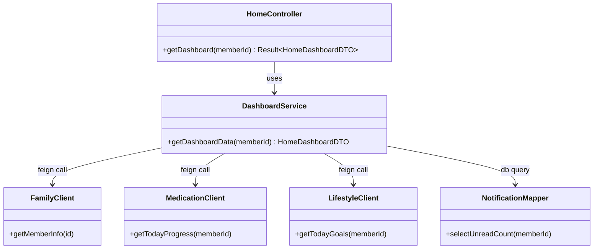
```mermaid
classDiagram
    class HomeController {
        +getDashboard(memberId) Result~HomeDashboardDTO~
    }
    
    class DashboardService {
        +getDashboardData(memberId) HomeDashboardDTO
    }
    
    class FamilyClient {
        +getMemberInfo(id)
    }
    
    class MedicationClient {
        +getTodayProgress(memberId)
    }
    
    class LifestyleClient {
        +getTodayGoals(memberId)
    }
    
    class NotificationMapper {
        +selectUnreadCount(memberId)
    }

    HomeController --> DashboardService : uses
    DashboardService --> FamilyClient : feign call
    DashboardService --> MedicationClient : feign call
    DashboardService --> LifestyleClient : feign call
    DashboardService --> NotificationMapper : db query
```

**7. 类协作图 (Collaboration Diagram)**

展示 `getDashboard` 方法的内部对象协作流程。

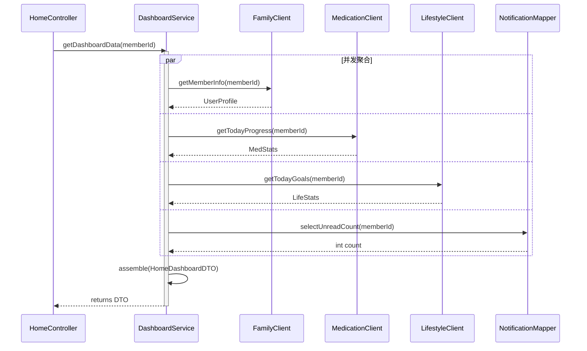
```mermaid
sequenceDiagram
    participant Ctrl as HomeController
    participant Svc as DashboardService
    participant Fam as FamilyClient
    participant Med as MedicationClient
    participant Life as LifestyleClient
    participant Noti as NotificationMapper

    Ctrl->>Svc: getDashboardData(memberId)
    activate Svc
    
    par 并发聚合
        Svc->>Fam: getMemberInfo(memberId)
        Fam-->>Svc: UserProfile
    and
        Svc->>Med: getTodayProgress(memberId)
        Med-->>Svc: MedStats
    and
        Svc->>Life: getTodayGoals(memberId)
        Life-->>Svc: LifeStats
    and
        Svc->>Noti: selectUnreadCount(memberId)
        Noti-->>Svc: int count
    end
    
    Svc->>Svc: assemble(HomeDashboardDTO)
    Svc-->>Ctrl: returns DTO
    deactivate Svc
```


#### 3.2.8 接口定义

**1. 获取首页仪表盘数据**

- **URL**: `/api/home/dashboard`
- **Method**: `GET`
- **Content-Type**: `application/json`

**Response Body:**

```json
{
  "code": 200,
  "data": {
    "greeting": "上午好，张三",
    "shortcuts": [
      { "id": "scan_med", "name": "扫药盒", "icon": "url..." },
      { "id": "upload_record", "name": "拍病历", "icon": "url..." }
    ],
    "todayProgress": {
      "medication": { "total": 3, "completed": 1 },
      "exercise": { "target": 6000, "current": 2500, "unit": "steps" }
    },
    "recentUpdates": [
      { "type": "REPORT", "title": "血常规报告已出", "time": "10:00", "link": "..." }
    ]
  }
}
```

### 3.3 家庭成员管理模块 (F-001)

#### 3.3.1 功能标识

- **功能ID：** F-001
- **功能名称：** 家庭成员管理
- **英文名称：** Family Member Management
- **所属模块：** 基础管理模块
- **版本号：** v1.0

#### 3.3.2 页面原型与交互设计

**1. 家庭成员列表页**


**界面元素：**

| 元素     | 类型                 | 说明                   | 交互行为                        |
| :------- | :------------------- | :--------------------- | :------------------------------ |
| 成员列表 | RecyclerView         | 展示所有成员卡片       | 点击卡片进入"个人档案"          |
| 成员卡片 | CardView             | 含头像、姓名、关系徽章 | 徽章背景色区分关系(如绿色=本人) |
| 添加按钮 | FloatingActionButton | 悬浮于右下角           | 点击跳转"添加成员"页            |

**主要交互 - 加载成员列表：**

*   **交互描述：** 用户进入页面时，系统通过 `family_id` 拉取所有成员，并根据关系优先级（本人 > 配偶 > 子女 > 其他）进行排序展示。
*   **涉及数据结构：** `List<FamilyMemberDTO>`
*   **涉及数据库表：** `t_family_member`
*   **时序图：**

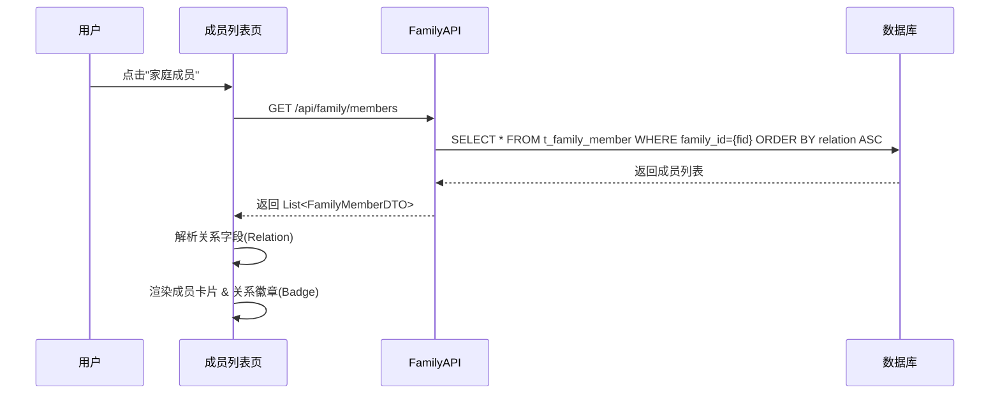
```mermaid
sequenceDiagram
    participant User as 用户
    participant UI as 成员列表页
    participant API as FamilyAPI
    participant DB as 数据库

    User->>UI: 点击"家庭成员"
    UI->>API: GET /api/family/members
    API->>DB: SELECT * FROM t_family_member WHERE family_id={fid} ORDER BY relation ASC
    DB-->>API: 返回成员列表
    API-->>UI: 返回 List<FamilyMemberDTO>
    UI->>UI: 解析关系字段(Relation)
    UI->>UI: 渲染成员卡片 & 关系徽章(Badge)
```

**2. 添加成员页**


**界面元素：**

| 元素     | 类型             | 说明                | 交互行为                 |
| :------- | :--------------- | :------------------ | :----------------------- |
| 头像上传 | ImageView        | 圆形占位符+相机图标 | 点击调用系统相册/相机    |
| 姓名输入 | EditText         | 必填，限制50字符    | 输入时实时校验长度       |
| 性别选择 | ChipGroup        | 单选：男/女         | 点击切换选中状态         |
| 出生日期 | TextView         | 显示"请选择"或日期  | 点击弹出DatePickerDialog |
| 关系选择 | Spinner/Dropdown | 预设关系列表        | 点击弹出选择菜单         |
| 角色开关 | Switch           | 设为管理员          | 切换开关状态             |
| 保存按钮 | Button           | 底部大按钮          | 点击提交表单             |

**主要交互 - 添加成员：**

*   **交互描述：** 用户填写完整信息并点击保存。系统需进行前端校验（必填项、格式），若包含头像则先上传至OSS获取URL，最后提交至后端。
*   **涉及数据结构：** `AddMemberRequest` (含 `avatarUrl`)
*   **涉及数据库表：** `t_family_member`
*   **时序图：**

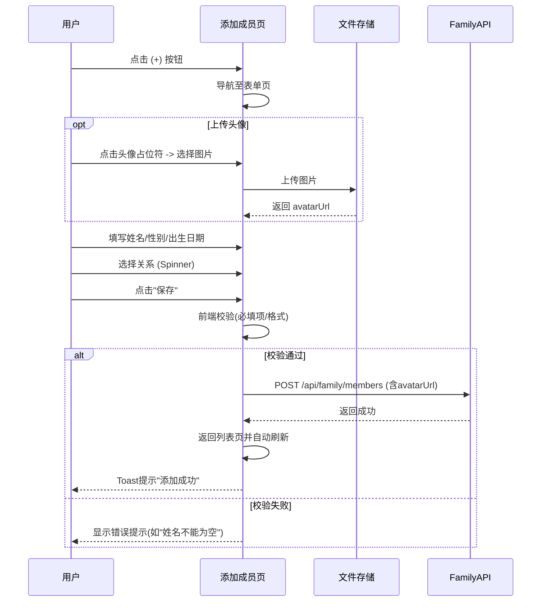
```mermaid
sequenceDiagram
    participant User as 用户
    participant UI as 添加成员页
    participant OSS as 文件存储
    participant API as FamilyAPI

    User->>UI: 点击 (+) 按钮
    UI->>UI: 导航至表单页
    
    opt 上传头像
        User->>UI: 点击头像占位符 -> 选择图片
        UI->>OSS: 上传图片
        OSS-->>UI: 返回 avatarUrl
    end

    User->>UI: 填写姓名/性别/出生日期
    User->>UI: 选择关系 (Spinner)
    User->>UI: 点击"保存"
    
    UI->>UI: 前端校验(必填项/格式)
    alt 校验通过
        UI->>API: POST /api/family/members (含avatarUrl)
        API-->>UI: 返回成功
        UI->>UI: 返回列表页并自动刷新
        UI-->>User: Toast提示"添加成功"
    else 校验失败
        UI-->>User: 显示错误提示(如"姓名不能为空")
    end
```

**3. 个人档案页**


**界面元素：**

| 元素     | 类型         | 说明                      | 交互行为              |
| :------- | :----------- | :------------------------ | :-------------------- |
| 隐私开关 | ToggleButton | 眼睛图标                  | 点击切换脱敏/明文显示 |
| 档案入口 | TabLayout    | 切换"个人档案"/"诊疗记录" | 点击切换Fragment      |
| 概览卡片 | CardView     | 显示BMI/过敏等关键指标    | 点击可跳转编辑        |

**主要交互 1 - 加载档案：**

*   **交互描述：** 进入页面时，同时获取成员基础信息和健康概览信息（身高体重、慢病等）。
*   **涉及数据结构：** `FamilyMember` (含 `HealthInfo`)
*   **涉及数据库表：** `t_family_member`, `t_member_health_profile`
*   **时序图：**

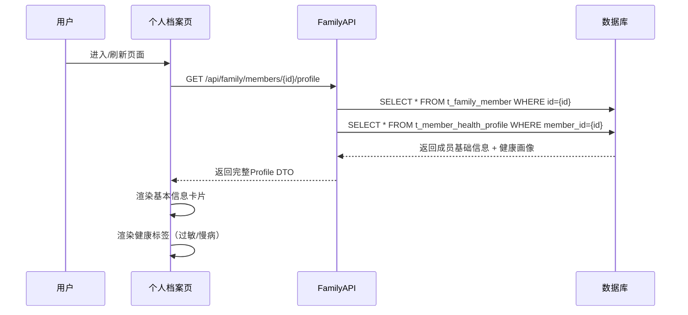
```mermaid
sequenceDiagram
    participant User as 用户
    participant UI as 个人档案页
    participant API as FamilyAPI
    participant DB as 数据库

    User->>UI: 进入/刷新页面
    UI->>API: GET /api/family/members/{id}/profile
    API->>DB: SELECT * FROM t_family_member WHERE id={id}
    API->>DB: SELECT * FROM t_member_health_profile WHERE member_id={id}
    DB-->>API: 返回成员基础信息 + 健康画像
    API-->>UI: 返回完整Profile DTO
    UI->>UI: 渲染基本信息卡片
    UI->>UI: 渲染健康标签（过敏/慢病）
```

**主要交互 2 - 隐私模式切换：**

*   **交互描述：** 点击小眼睛图标，前端实时切换敏感字段（姓名、证件号）的显示/脱敏状态。
*   **涉及逻辑：** 前端数据掩码工具类
*   **时序图：**

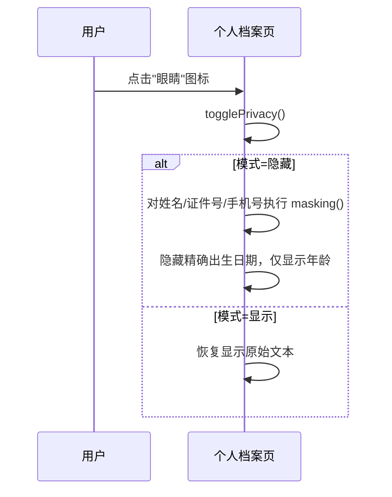
```mermaid
sequenceDiagram
    participant User as 用户
    participant UI as 个人档案页

    User->>UI: 点击"眼睛"图标
    UI->>UI: togglePrivacy()
    alt 模式=隐藏
        UI->>UI: 对姓名/证件号/手机号执行 masking()
        UI->>UI: 隐藏精确出生日期，仅显示年龄
    else 模式=显示
        UI->>UI: 恢复显示原始文本
    end
```

#### 3.3.3 功能概述

**业务价值：** 为家庭提供统一的成员管理能力，支持多家庭成员的健康数据集中管理和共享权限控制。

**主要用户：**
- 家庭管理员
- 家庭成员

**系统定位：** 系统的基础功能，所有健康数据管理的起点。

**前置条件：**
- 用户已完成注册登录
- 用户已创建家庭或被邀请加入家庭

**后置结果：**
- 家庭成员信息录入系统
- 成员间数据共享权限配置完成

#### 3.3.4 原始需求

**需求来源：** 需求规格说明书 3.1 章节

**需求描述：**
> 家庭管理员可以添加新的家庭成员到家庭病历本中，支持输入成员姓名、性别、出生日期、关系等基本信息，支持上传成员头像，支持设置成员角色（家庭成员或家庭管理员），支持设置成员权限。一个家庭最多支持10个成员。

**相关需求：**
- F-002：病历文书导入（需关联到具体成员）
- F-006：数据共享设置

#### 3.3.5 正常流程

**文字描述：**

1. 用户进入家庭成员管理页面
2. 点击"添加成员"按钮
3. 填写成员基本信息（姓名、性别、出生日期、关系）
4. 设置成员角色（家庭管理员/家庭成员）
5. 设置数据访问权限
6. 上传成员头像（可选）
7. 点击"保存"按钮
8. 前端调用 POST /api/family/members 接口
9. 后端验证参数完整性和合法性
10. 检查家庭成员数量限制（最多10人）
11. 保存成员信息到数据库
12. 返回成功响应
13. 前端显示成功提示并刷新成员列表

**序列图：**

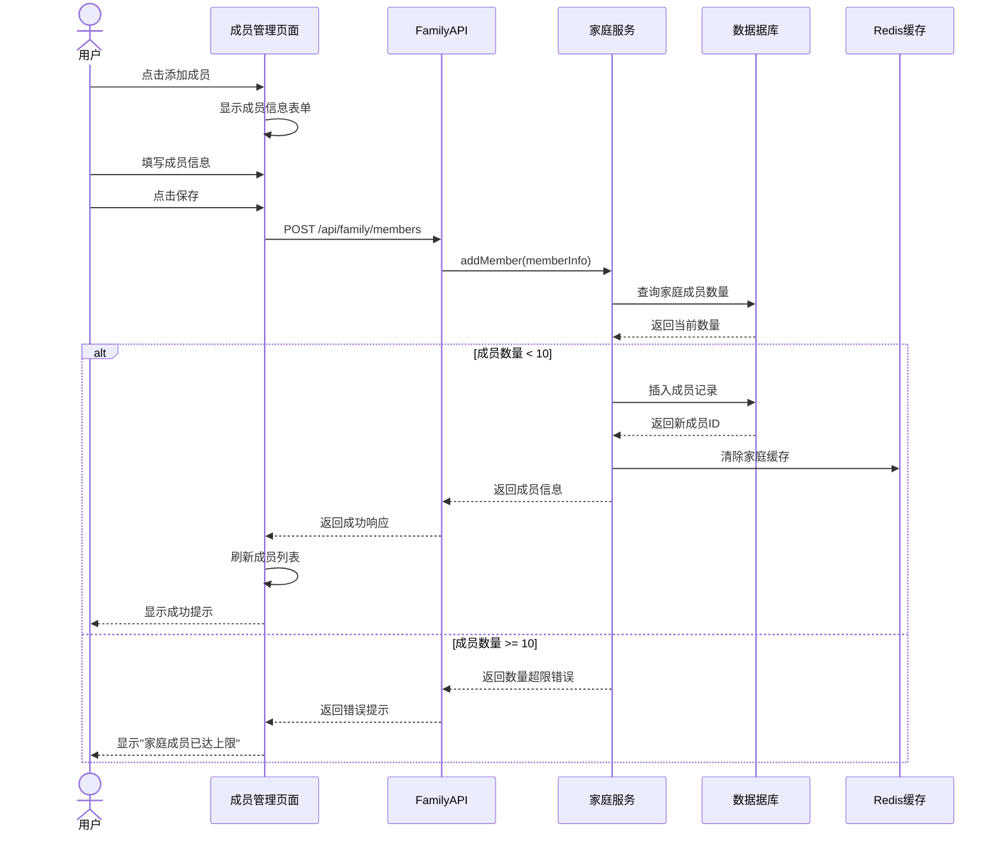
```mermaid
sequenceDiagram
    actor User as 用户
    participant UI as 成员管理页面
    participant API as FamilyAPI
    participant FamilyService as 家庭服务
    participant DB as 数据据库
    participant Cache as Redis缓存

    User->>UI: 点击添加成员
    UI->>UI: 显示成员信息表单
    User->>UI: 填写成员信息
    User->>UI: 点击保存
    UI->>API: POST /api/family/members

    API->>FamilyService: addMember(memberInfo)
    FamilyService->>DB: 查询家庭成员数量
    DB-->>FamilyService: 返回当前数量

    alt 成员数量 < 10
        FamilyService->>DB: 插入成员记录
        DB-->>FamilyService: 返回新成员ID

        FamilyService->>Cache: 清除家庭缓存
        FamilyService-->>API: 返回成员信息
        API-->>UI: 返回成功响应
        UI->>UI: 刷新成员列表
        UI-->>User: 显示成功提示
    else 成员数量 >= 10
        FamilyService-->>API: 返回数量超限错误
        API-->>UI: 返回错误提示
        UI-->>User: 显示"家庭成员已达上限"
    end
```

#### 3.3.6 异常流程

| 异常场景     | 触发条件               | 系统行为    | 用户提示                               |
| ------------ | ---------------------- | ----------- | -------------------------------------- |
| 姓名为空     | 必填字段未填写         | 返回400错误 | 请输入成员姓名                         |
| 出生日期无效 | 日期格式错误或未来日期 | 返回400错误 | 请输入有效的出生日期                   |
| 成员数量超限 | 家庭成员数≥10          | 返回403错误 | 家庭成员已达上限（10人），无法继续添加 |
| 头像文件过大 | 文件>5MB               | 返回400错误 | 头像文件大小不能超过5MB                |
| 头像格式错误 | 非图片格式             | 返回400错误 | 仅支持JPG、PNG格式图片                 |
| 网络超时     | 请求超过30秒           | 自动重试3次 | 网络连接超时，请检查网络               |
| 未登录       | Token过期              | 跳转登录页  | 登录已过期，请重新登录                 |

#### 3.3.7 状态转换

| 状态     | 说明     | 可执行操作         |
| -------- | -------- | ------------------ |
| ACTIVE   | 正常状态 | 查看档案、导入病历 |
| INACTIVE | 停用状态 | 仅查看，不能操作   |
| DELETED  | 已删除   | 无操作             |

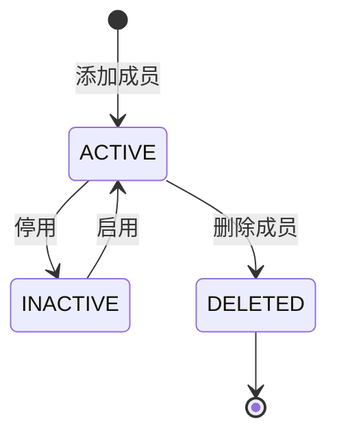
```mermaid
stateDiagram-v2
    [*] --> ACTIVE: 添加成员
    ACTIVE --> INACTIVE: 停用
    INACTIVE --> ACTIVE: 启用
    ACTIVE --> DELETED: 删除成员
    DELETED --> [*]
```

#### 3.3.8 输入数据

**数据来源：** 用户输入表单

**数据格式：**
```json
{
  "name": "string",           // 姓名，必填，1-50字符
  "gender": "MALE|FEMALE",    // 性别，必填
  "birthDate": "YYYY-MM-DD",  // 出生日期，必填
  "relation": "string",       // 关系，必填（本人、配偶、父亲、母亲、子女等）
  "role": "ADMIN|MEMBER",     // 角色，必填
  "avatar": "base64_string",  // 头像，可选
  "permissions": {
    "viewAll": boolean,       // 是否可查看所有人数据
    "editAll": boolean        // 是否可编辑所有人数据
  }
}
```

**校验规则：**
| 字段      | 校验规则             | 错误提示             |
| --------- | -------------------- | -------------------- |
| name      | 非空，1-50字符       | 姓名长度为1-50个字符 |
| gender    | 必选MALE或FEMALE     | 请选择性别           |
| birthDate | 非空，不晚于当前日期 | 出生日期不能晚于今天 |
| relation  | 非空                 | 请选择与成员的关系   |

#### 3.3.9 输出数据

**成功响应：**
```json
{
  "code": 200,
  "message": "添加成功",
  "data": {
    "memberId": "10001",
    "name": "张三",
    "gender": "MALE",
    "birthDate": "1980-01-01",
    "relation": "本人",
    "role": "ADMIN",
    "avatar": "https://cdn.example.com/avatar/10001.jpg",
    "permissions": {
      "viewAll": true,
      "editAll": true
    },
    "createTime": "2024-01-15T10:30:00Z"
  }
}
```

**失败响应：**
```json
{
  "code": 400,
  "message": "参数校验失败",
  "data": {
    "field": "name",
    "error": "姓名不能为空"
  }
}
```

#### 3.3.10 类设计

**1. API Layer (Controller/Router)**

- **FamilyController**: 家庭成员管理接口控制器。
  - `addMember()`: 添加家庭成员。
  - `getMembers()`: 获取家庭成员列表。
  - `updateMember()`: 更新成员信息。
  - `deleteMember()`: 删除成员。
  - **Router Definition**:
    ```java
    @RestController
    @RequestMapping("/api/family/members")
    public class FamilyController {
        @PostMapping
        public Result<Long> addMember(@RequestBody @Valid AddMemberRequest request);
        
        @GetMapping
        public Result<List<FamilyMemberDTO>> getMembers(@RequestParam(required = false) Long familyId);
        
        @GetMapping("/{id}")
        public Result<MemberProfileDTO> getMemberProfile(@PathVariable Long id);
    }
    ```

**2. Service Layer**

- **FamilyService**: 业务逻辑实现。
  - `addMember`: 校验成员数量上限 (<10)，加密敏感字段，保存数据。
  - `checkAuthority`: 校验操作人是否有权限查看/编辑目标成员数据。
  - **Dependencies**: `OSSService` (Avatar upload).

**3. Data Access Layer**

- **FamilyMemberMapper**: 访问 `t_family_member` 表。
  - `insert(FamilyMember member)`
  - `selectByFamilyId(Long familyId)`
  - `countByFamilyId(Long familyId)`
- **MemberProfileMapper**: 访问 `t_member_health_profile` 表。
  - `selectByMemberId(Long memberId)`

**4. External Services**

- **OSSService**: 文件存储抽象服务。
  - `uploadFile(InputStream is, String fileName)`
- **RedisService**: 缓存服务。
  - `evictCache(String key)`

**5. Model Layer**

- **entity.FamilyMember**: 对应 `t_family_member` 表。
- **dto.AddMemberRequest**: 添加成员请求体。
- **dto.MemberProfileDTO**: 成员档案详情DTO。

**6. 静态结构图 (Class Diagram)**

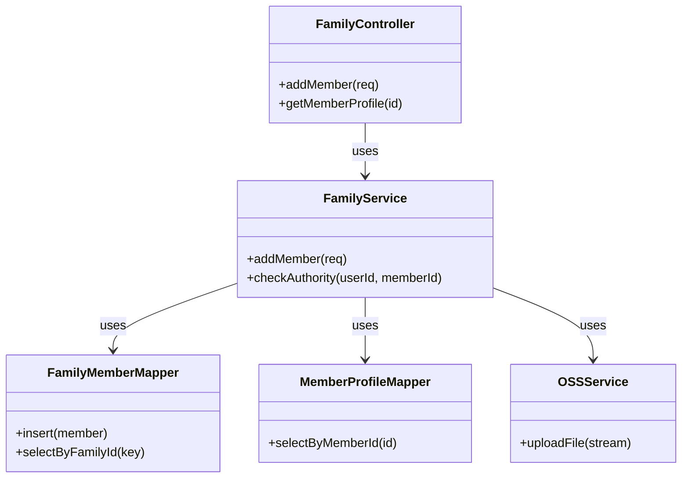
```mermaid
classDiagram
    class FamilyController {
        +addMember(req)
        +getMemberProfile(id)
    }
    
    class FamilyService {
        +addMember(req)
        +checkAuthority(userId, memberId)
    }
    
    class FamilyMemberMapper {
        +insert(member)
        +selectByFamilyId(key)
    }
    
    class OSSService {
        +uploadFile(stream)
    }
    
    class MemberProfileMapper {
        +selectByMemberId(id)
    }

    FamilyController --> FamilyService : uses
    FamilyService --> FamilyMemberMapper : uses
    FamilyService --> MemberProfileMapper : uses
    FamilyService --> OSSService : uses
```

**7. 类协作图 (Collaboration Diagram)**

展示 `addMember` (添加家庭成员) 的内部协作。

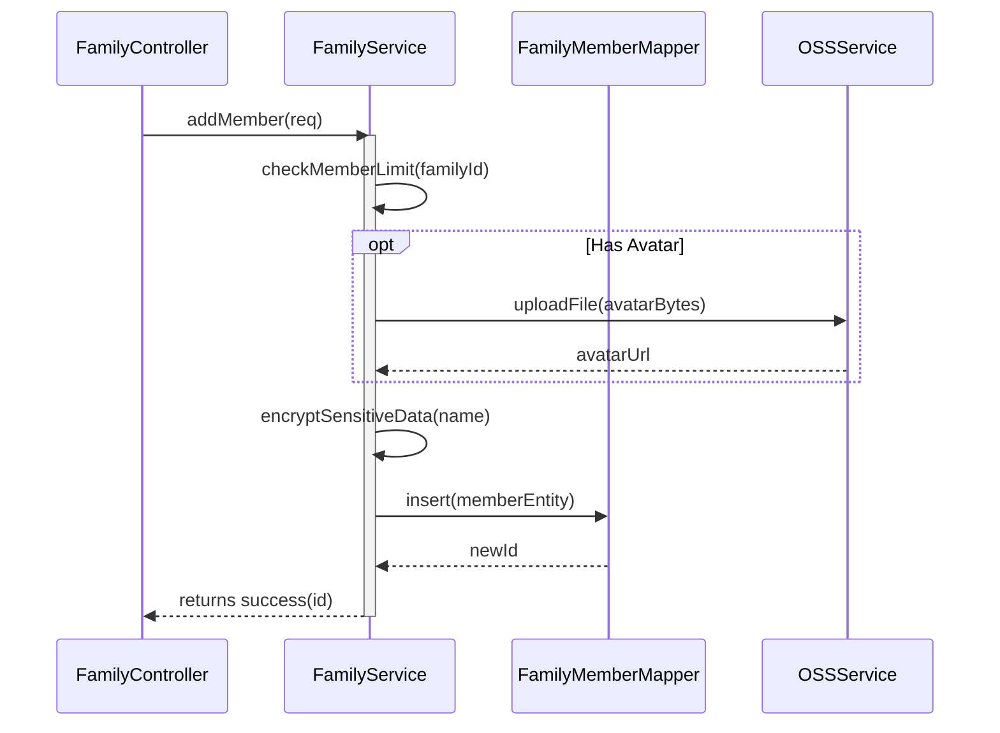
```mermaid
sequenceDiagram
    participant Ctrl as FamilyController
    participant Svc as FamilyService
    participant Mapper as FamilyMemberMapper
    participant OSS as OSSService

    Ctrl->>Svc: addMember(req)
    activate Svc
    
    Svc->>Svc: checkMemberLimit(familyId)
    
    opt Has Avatar
        Svc->>OSS: uploadFile(avatarBytes)
        OSS-->>Svc: avatarUrl
    end
    
    Svc->>Svc: encryptSensitiveData(name)
    Svc->>Mapper: insert(memberEntity)
    Mapper-->>Svc: newId
    
    Svc-->>Ctrl: returns success(id)
    deactivate Svc
```


#### 3.3.11 数据库详细设计

**Table: t_family_member (家庭成员表)**

```sql
CREATE TABLE `t_family_member` (
  `id` bigint(20) NOT NULL AUTO_INCREMENT COMMENT '主键ID',
  `family_id` bigint(20) NOT NULL COMMENT '家庭ID',
  `user_id` bigint(20) DEFAULT NULL COMMENT '关联用户ID (若该成员也是系统用户)',
  `name` varchar(255) NOT NULL COMMENT '成员姓名 (加密存储)',
  `gender` tinyint(4) NOT NULL COMMENT '性别：1-男，2-女',
  `birth_date` date NOT NULL COMMENT '出生日期',
  `relation` varchar(20) NOT NULL COMMENT '与户主关系 (SELF, SPOUSE, CHILD, PARENT, OTHER)',
  `role` tinyint(4) NOT NULL DEFAULT '2' COMMENT '角色：1-管理员，2-普通成员',
  `avatar_url` varchar(500) DEFAULT NULL COMMENT '头像URL',
  `view_all` tinyint(1) NOT NULL DEFAULT '0' COMMENT '权限：是否可查看所有人数据',
  `edit_all` tinyint(1) NOT NULL DEFAULT '0' COMMENT '权限：是否可编辑所有人数据',
  `status` tinyint(4) NOT NULL DEFAULT '1' COMMENT '状态：1-正常，2-停用，3-删除',
  `create_time` datetime NOT NULL DEFAULT CURRENT_TIMESTAMP COMMENT '创建时间',
  `update_time` datetime NOT NULL DEFAULT CURRENT_TIMESTAMP ON UPDATE CURRENT_TIMESTAMP COMMENT '更新时间',
  PRIMARY KEY (`id`),
  KEY `idx_family_id` (`family_id`) USING BTREE COMMENT '通过家庭ID查询',
  KEY `idx_user_id` (`user_id`) USING BTREE
) ENGINE=InnoDB DEFAULT CHARSET=utf8mb4 COMMENT='家庭成员表';
```

**Table: t_member_health_profile (成员健康基础档案表)**

```sql
CREATE TABLE `t_member_health_profile` (
  `member_id` bigint(20) NOT NULL COMMENT '成员ID (FK)',
  `height` decimal(5,2) DEFAULT NULL COMMENT '身高(cm)',
  `weight` decimal(5,2) DEFAULT NULL COMMENT '体重(kg)',
  `blood_type` varchar(10) DEFAULT NULL COMMENT '血型 (A, B, AB, O, OTHER)',
  `allergies` json DEFAULT NULL COMMENT '过敏史列表 (JSON array)',
  `chronic_diseases` json DEFAULT NULL COMMENT '慢性病列表 (JSON array)',
  `update_time` datetime NOT NULL DEFAULT CURRENT_TIMESTAMP ON UPDATE CURRENT_TIMESTAMP COMMENT '最后更新时间',
  PRIMARY KEY (`member_id`),
  CONSTRAINT `fk_profile_member` FOREIGN KEY (`member_id`) REFERENCES `t_family_member` (`id`) ON DELETE CASCADE
) ENGINE=InnoDB DEFAULT CHARSET=utf8mb4 COMMENT='成员健康基础档案表';
```

#### 3.3.12 接口定义

**1. 添加家庭成员**

- **URL**: `/api/family/members`
- **Method**: `POST`
- **Content-Type**: `application/json`
- **Authentication**: Bearer Token required

**Request Body:**

```json
{
  "name": "张三",
  "gender": "MALE",
  "birthDate": "1990-01-01",
  "relation": "SELF",
  "role": "ADMIN",
  "avatarUrl": "https://oss.example.com/avatars/temp_123.jpg",
  "permissions": {
    "viewAll": true,
    "editAll": true
  }
}
```

**Response Body (Success):**

```json
{
  "code": 200,
  "message": "添加成功",
  "data": {
    "memberId": "10086",
    "createTime": "2024-01-25 10:00:00"
  }
}
```

**2. 获取家庭成员列表**

- **URL**: `/api/family/members`
- **Method**: `GET`
- **Query Params**:
  - `familyId` (Optional): ID of family, defaults to current user's family.

**Response Body:**

```json
{
  "code": 200,
  "data": [
    {
      "memberId": "10086",
      "name": "张三",
      "relation": "SELF",
      "avatarUrl": "...",
      "role": "ADMIN"
    },
    ...
  ]
}
```

---

### 3.4 病历文书导入模块 (F-002)

#### 3.4.1 功能标识

- **功能ID：** F-002
- **功能名称：** 病历文书导入
- **英文名称：** Medical Record Import
- **所属模块：** 健康档案模块
- **版本号：** v1.0

#### 3.4.2 页面原型与交互设计

**1. 导入/病历列表页**


**界面元素：**

| 元素         | 说明                    |
| :----------- | :---------------------- |
| 文件选择区   | 支持点击或拖拽上传      |
| 拍照上传     | 调用相机拍照            |
| 文件列表     | 显示已选文件，支持删除  |
| 上传按钮     | 开始上传并解析          |
| 处理进度     | 显示每个文件的处理状态  |
| 自动处理说明 | 列出OCR、抽取、脱敏功能 |

**主要交互 - 导入/病历列表加载：**

*   **交互描述：** 用户查看记录列表或进入导入页查看任务。
*   **涉及数据结构：** `List<RecordSummary>`
*   **涉及数据库表：** `t_medical_record`, `t_document`
*   **时序图：**

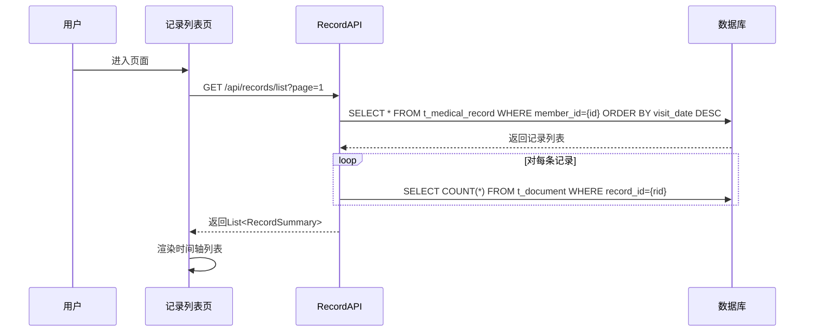
```mermaid
sequenceDiagram
    participant User as 用户
    participant UI as 记录列表页
    participant API as RecordAPI
    participant DB as 数据库

    User->>UI: 进入页面
    UI->>API: GET /api/records/list?page=1
    API->>DB: SELECT * FROM t_medical_record WHERE member_id={id} ORDER BY visit_date DESC
    DB-->>API: 返回记录列表
    loop 对每条记录
        API->>DB: SELECT COUNT(*) FROM t_document WHERE record_id={rid}
    end
    API-->>UI: 返回List<RecordSummary>
    UI->>UI: 渲染时间轴列表
```

**2. 上传弹窗**


**主要交互 - 触发病历上传：**

*   **交互描述：** 用户选择文件/拍照后，点击上传。系统执行前端直传OSS，随后后端创建异步解析任务（OCR+NLP）。
*   **涉及数据结构：** `ImportTask`
*   **涉及数据库表：** `t_document` (暂存), `MQ` (任务)
*   **时序图：**

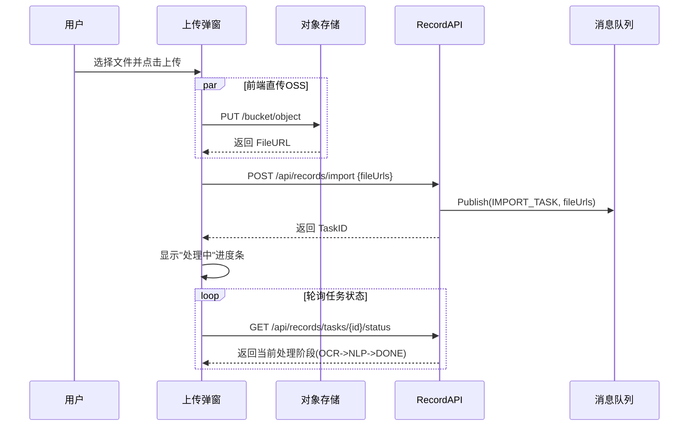
```mermaid
sequenceDiagram
    participant User as 用户
    participant UI as 上传弹窗
    participant OSS as 对象存储
    participant API as RecordAPI
    participant Queue as 消息队列

    User->>UI: 选择文件并点击上传
    par 前端直传OSS
        UI->>OSS: PUT /bucket/object
        OSS-->>UI: 返回 FileURL
    end
    UI->>API: POST /api/records/import {fileUrls}
    API->>Queue: Publish(IMPORT_TASK, fileUrls)
    API-->>UI: 返回 TaskID
    UI->>UI: 显示"处理中"进度条
    
    loop 轮询任务状态
        UI->>API: GET /api/records/tasks/{id}/status
        API-->>UI: 返回当前处理阶段(OCR->NLP->DONE)
    end
```

**智能识别流程：**
1. **多模态上传：** 支持拍照（含裁剪旋转）和文件选择（多选PDF/图片）。
2. **智能解析反馈：** 实时进度条显示OCR/NLP状态；完成后自动生成摘要（医院、科室、时间）并标记完成。

#### 3.4.3 功能概述

**业务价值：** 实现病历文书的数字化导入，为后续的信息抽取、档案管理提供数据基础。

**主要用户：**
- 家庭管理员
- 家庭成员

**系统定位：** 健康档案管理的核心入口功能。

**前置条件：**
- 已选择要导入的目标家庭成员
- 用户已登录

**后置结果：**
- 病历文书文件上传成功
- OCR识别完成
- 信息抽取完成
- 档案记录生成

#### 3.4.4 原始需求

**需求来源：** 需求规格说明书 3.2.1 章节

**需求描述：**
> 用户可以为当前选中的家庭成员导入病历文书（影像件或PDF文件），系统自动识别并提取收费和结算信息。支持导入PDF格式的病历文书，支持导入常见图片格式（JPG、PNG、JPEG）。单次支持导入多个文件（最多10个），文件大小限制：单个文件不超过20MB。

#### 3.4.5 正常流程

**文字描述：**

1. 用户选择当前家庭成员
2. 进入"导入病历"页面
3. 选择上传方式（拍照/选择文件）
4. 选择病历文件（支持多选）
5. 系统显示文件列表和大小
6. 用户确认上传
7. 前端上传文件到OSS
8. 调用后端接口创建导入任务
9. 后端调用OCR服务识别文件内容
10. 后端调用AI服务抽取关键信息
11. 后端进行个人信息脱敏处理
12. 保存抽取结果到数据库
13. 分析材料完整度
14. 返回导入结果
15. 前端显示导入进度和结果

**序列图：**

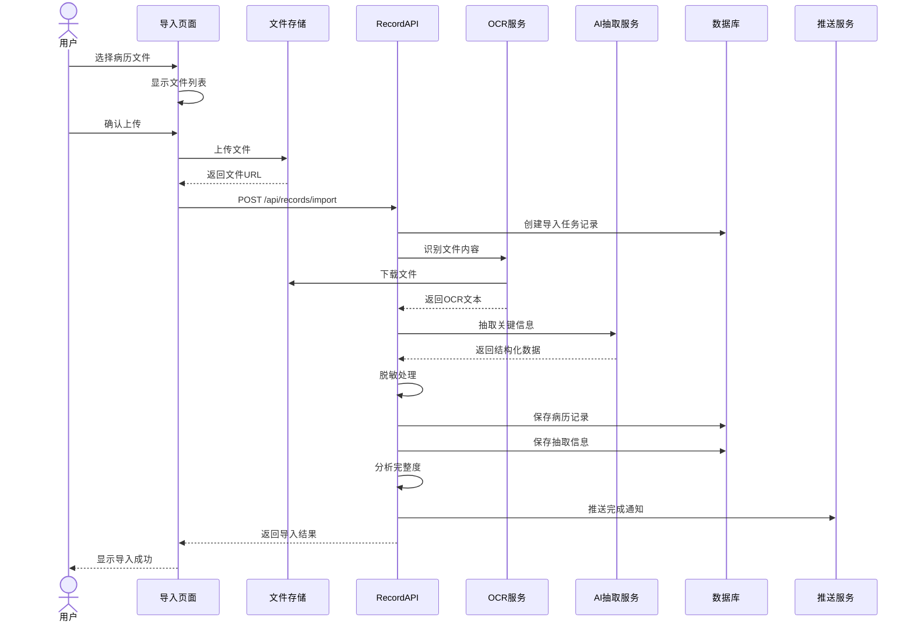
```mermaid
sequenceDiagram
    actor User as 用户
    participant UI as 导入页面
    participant OSS as 文件存储
    participant API as RecordAPI
    participant OCRService as OCR服务
    participant AIService as AI抽取服务
    participant DB as 数据库
    participant Push as 推送服务

    User->>UI: 选择病历文件
    UI->>UI: 显示文件列表
    User->>UI: 确认上传
    UI->>OSS: 上传文件
    OSS-->>UI: 返回文件URL

    UI->>API: POST /api/records/import
    API->>DB: 创建导入任务记录

    API->>OCRService: 识别文件内容
    OCRService->>OSS: 下载文件
    OCRService-->>API: 返回OCR文本

    API->>AIService: 抽取关键信息
    AIService-->>API: 返回结构化数据

    API->>API: 脱敏处理
    API->>DB: 保存病历记录
    API->>DB: 保存抽取信息
    API->>API: 分析完整度

    API->>Push: 推送完成通知
    API-->>UI: 返回导入结果
    UI-->>User: 显示导入成功
```

#### 3.4.6 异常流程

| 异常场景     | 触发条件              | 系统行为     | 用户提示                     |
| ------------ | --------------------- | ------------ | ---------------------------- |
| 文件格式错误 | 非PDF/图片格式        | 拒绝上传     | 仅支持PDF、JPG、PNG格式      |
| 文件过大     | 单文件>20MB           | 拒绝上传     | 文件大小不能超过20MB         |
| 文件数量超限 | 单次>10个             | 拒绝上传     | 单次最多上传10个文件         |
| OCR识别失败  | 文件质量差/格式不支持 | 标记失败     | 文件识别失败，请尝试重新拍摄 |
| 抽取失败     | AI服务异常            | 保存原始文件 | 信息抽取失败，可手动补充     |
| 网络中断     | 上传中断              | 支持断点续传 | 网络中断，已上传文件已保存   |

#### 3.4.7 状态转换

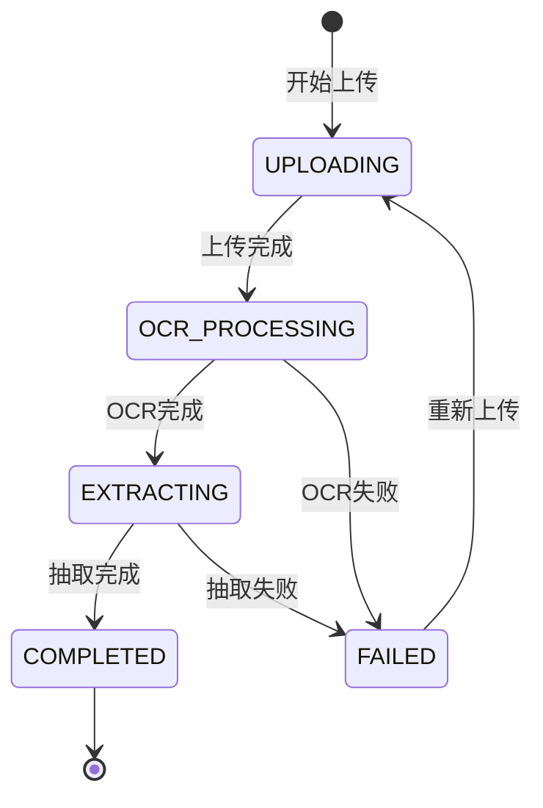
```mermaid
stateDiagram-v2
    [*] --> UPLOADING: 开始上传
    UPLOADING --> OCR_PROCESSING: 上传完成
    OCR_PROCESSING --> EXTRACTING: OCR完成
    EXTRACTING --> COMPLETED: 抽取完成
    OCR_PROCESSING --> FAILED: OCR失败
    EXTRACTING --> FAILED: 抽取失败
    FAILED --> UPLOADING: 重新上传
    COMPLETED --> [*]
```

#### 3.4.8 输入数据

```json
{
  "memberId": "string",        // 目标成员ID，必填
  "files": [
    {
      "fileName": "string",    // 文件名
      "fileType": "PDF|JPG|PNG|JPEG",
      "fileSize": number,      // 文件大小（字节）
      "fileUrl": "string",     // OSS URL
      "uploadTime": "string"   // 上传时间
    }
  ],
  "source": "HOSPITAL|SELF"    // 来源
}
```

#### 3.4.9 输出数据

```json
{
  "code": 200,
  "message": "导入任务创建成功",
  "data": {
    "taskId": "TASK_20240115_001",
    "memberId": "10001",
    "fileCount": 3,
    "status": "PROCESSING",
    "estimatedTime": 30,
    "results": [
      {
        "fileName": "门诊病历.pdf",
        "status": "COMPLETED",
        "recordId": "REC_001",
        "completeness": 85,
        "missingDocs": ["费用清单"]
      }
    ]
  }
}
```

#### 3.4.10 类设计

**1. API Layer (Controller/Router)**

- **RecordController**: 病历管理接口控制器。
  - `importRecords()`: 提交导入任务。
  - `getTaskStatus()`: 查询导入进度。
  - `listRecords()`: 分页查询病历列表。
  - **Router Definition**:
    ```java
    @RestController
    @RequestMapping("/api/records")
    public class RecordController {
        @PostMapping("/import")
        public Result<String> importRecords(@RequestBody ImportRequest request);
        
        @GetMapping("/tasks/{taskId}")
        public Result<TaskStatusDTO> getTaskStatus(@PathVariable String taskId);
        
        @GetMapping
        public Result<Page<RecordSummary>> listRecords(@RequestParam Long memberId, Pageable page);
    }
    ```

**2. Service Layer**

- **RecordService**: 核心业务类。
  - `createImportTask()`: 创建异步任务，发送消息到MQ。
  - `processRecordTask()`: 消费者，处理OCR和NLP流程。
- **ImportStrategyFactory**: 导入策略工厂（支持不同文件类型PDF/Image处理）。

**3. AI & External Layer**

- **OCRClient**: OCR服务客户端 (e.g. Aliyun OCR / Tesseract)。
  - `recognizeText(String fileUrl): String`
- **NLPClient**: 自然语言处理客户端 (LLM/Bert)。
  - `extractEntities(String text): ExtractedInfo`
  - `anonymize(String text): String` (脱敏)

**4. Data Access Layer**

- **MedicalRecordMapper**: 访问 `t_medical_record`。
- **DocumentMapper**: 访问 `t_document` (原始文件表)。
- **TaskRepository**: 访问 Redis/DB 获取任务状态。

**5. Model Layer**

- **entity.MedicalRecord**: 病历实体。
- **dto.ImportRequest**: 导入请求。
- **dto.ExtractedInfo**: 抽取结果结构体。

**6. 静态结构图 (Class Diagram)**

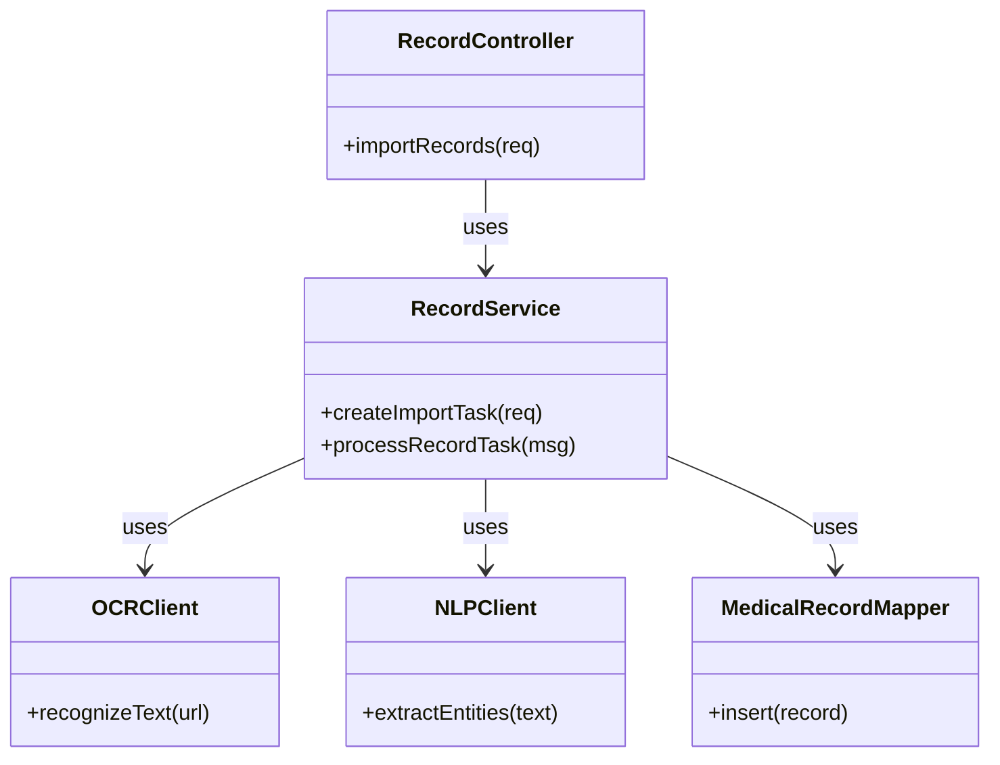
```mermaid
classDiagram
    class RecordController {
        +importRecords(req)
    }
    class RecordService {
        +createImportTask(req)
        +processRecordTask(msg)
    }
    class OCRClient {
        +recognizeText(url)
    }
    class NLPClient {
        +extractEntities(text)
    }
    class MedicalRecordMapper {
        +insert(record)
    }
    
    RecordController --> RecordService : uses
    RecordService --> OCRClient : uses
    RecordService --> NLPClient : uses
    RecordService --> MedicalRecordMapper : uses
```

**7. 类协作图 (Collaboration Diagram)**

展示 `processRecordTask` (后台异步处理) 的内部协作。

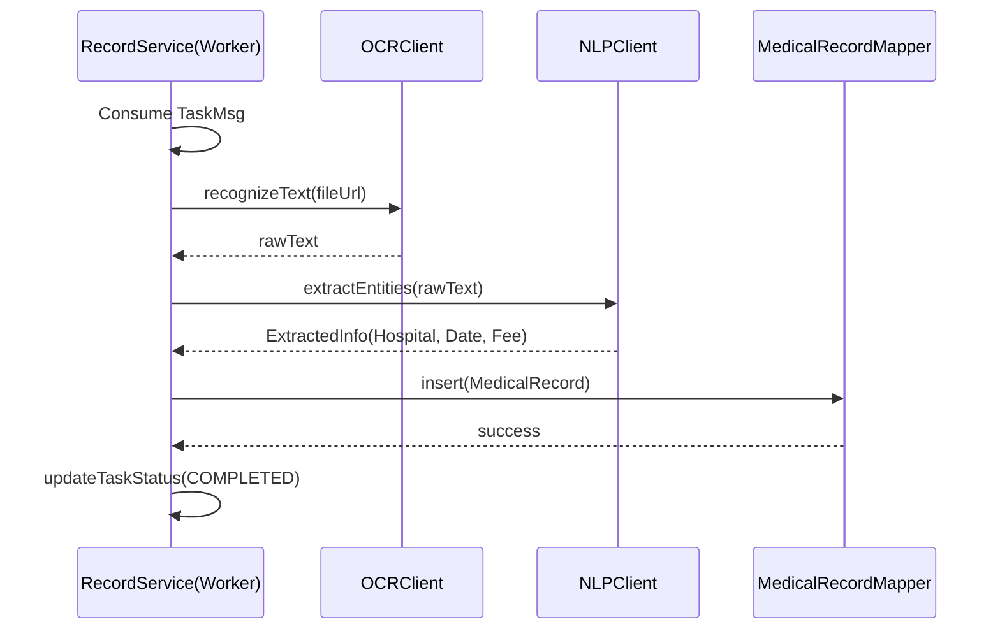
```mermaid
sequenceDiagram
    participant Worker as RecordService(Worker)
    participant OCR as OCRClient
    participant NLP as NLPClient
    participant DB as MedicalRecordMapper

    Worker->>Worker: Consume TaskMsg
    
    Worker->>OCR: recognizeText(fileUrl)
    OCR-->>Worker: rawText
    
    Worker->>NLP: extractEntities(rawText)
    NLP-->>Worker: ExtractedInfo(Hospital, Date, Fee)
    
    Worker->>DB: insert(MedicalRecord)
    DB-->>Worker: success
    
    Worker->>Worker: updateTaskStatus(COMPLETED)
```


```java
public interface RecordService {
    /**
     * 创建导入任务
     * @return 任务ID
     */
    String createImportTask(ImportRequest request);

    /**
     * 查询任务状态
     */
    ImportTaskStatus getTaskStatus(String taskId);

    /**
     * 保存解析结果
     */
    void saveRecord(MedicalRecord record, List<Document> docs);
}
```

#### 3.4.11 数据库详细设计

**Table: t_medical_record (病历记录表)**

```sql
CREATE TABLE `t_medical_record` (
  `id` bigint(20) NOT NULL AUTO_INCREMENT COMMENT '主键ID',
  `member_id` bigint(20) NOT NULL COMMENT '成员ID',
  `family_id` bigint(20) NOT NULL COMMENT '家庭ID',
  `record_type` tinyint(4) NOT NULL COMMENT '类型：1-门诊，2-住院，3-体检',
  `hospital_name` varchar(100) DEFAULT NULL COMMENT '医院名称',
  `department` varchar(50) DEFAULT NULL COMMENT '科室',
  `doctor_name` varchar(50) DEFAULT NULL COMMENT '医生姓名',
  `visit_date` date DEFAULT NULL COMMENT '就诊日期',
  `main_diagnosis` text COMMENT '主要诊断',
  `completeness` int(11) NOT NULL DEFAULT '0' COMMENT '完整度百分比',
  `status` tinyint(4) NOT NULL DEFAULT '1' COMMENT '状态：1-正常，2-删除',
  `create_time` datetime NOT NULL DEFAULT CURRENT_TIMESTAMP COMMENT '创建时间',
  `update_time` datetime NOT NULL DEFAULT CURRENT_TIMESTAMP ON UPDATE CURRENT_TIMESTAMP COMMENT '更新时间',
  PRIMARY KEY (`id`),
  KEY `idx_member_visit` (`member_id`,`visit_date`) USING BTREE COMMENT '成员就诊记录索引',
  KEY `idx_family_id` (`family_id`) USING BTREE
) ENGINE=InnoDB DEFAULT CHARSET=utf8mb4 COMMENT='病历记录表';
```

**Table: t_document (病历文书表)**

```sql
CREATE TABLE `t_document` (
  `id` bigint(20) NOT NULL AUTO_INCREMENT COMMENT '主键ID',
  `record_id` bigint(20) NOT NULL COMMENT '关联病历记录ID',
  `doc_type` varchar(50) NOT NULL COMMENT '文书类型 (如: 处方单, 检查报告)',
  `file_format` varchar(10) NOT NULL COMMENT '文件格式 (PDF, JPG)',
  `file_url` varchar(500) NOT NULL COMMENT '文件存储URL',
  `masked_url` varchar(500) DEFAULT NULL COMMENT '脱敏后文件URL',
  `ocr_status` tinyint(4) NOT NULL DEFAULT '0' COMMENT 'OCR状态：0-待处理，1-成功，2-失败',
  `extract_status` tinyint(4) NOT NULL DEFAULT '0' COMMENT '抽取状态：0-待处理，1-成功，2-失败',
  `file_size` bigint(20) NOT NULL COMMENT '文件大小（字节）',
  `upload_time` datetime NOT NULL DEFAULT CURRENT_TIMESTAMP COMMENT '上传时间',
  PRIMARY KEY (`id`),
  KEY `idx_record_id` (`record_id`) USING BTREE
) ENGINE=InnoDB DEFAULT CHARSET=utf8mb4 COMMENT='病历文书表';
```

#### 3.4.12 接口定义

**1. 创建病历导入任务**

- **URL**: `/api/records/import`
- **Method**: `POST`
- **Content-Type**: `application/json`

**Request Body:**

```json
{
  "memberId": "10086",
  "files": [
    {
      "fileName": "report.pdf",
      "fileUrl": "https://oss.../report.pdf",
      "fileSize": 102400,
      "fileType": "PDF"
    }
  ]
}
```

**Response Body:**

```json
{
  "code": 200,
  "data": {
    "taskId": "TASK_123456",
    "status": "QUEUED"
  }
}
```

**2. 查询任务状态**

- **URL**: `/api/records/tasks/{taskId}/status`
- **Method**: `GET`

**Response Body:**

```json
{
  "code": 200,
  "data": {
    "taskId": "TASK_123456",
    "status": "PROCESSING",
    "progress": 50,
    "currentStep": "OCR_RECOGNITION"
  }
}
```

**3. 获取病历列表**

- **URL**: `/api/records/list`
- **Method**: `GET`
- **Query Params**:
  - `memberId`: required
  - `page`: default 1
  - `pageSize`: default 20

**Response Body:**

```json
{
  "code": 200,
  "data": {
    "total": 10,
    "list": [
      {
        "id": "REC_001",
        "hospitalName": "第一人民医院",
        "visitDate": "2024-01-01",
        "docCount": 3
      }
    ]
  }
}
```

---

### 3.5 检查报告解读模块 (F-009)

#### 3.5.1 功能标识

- **功能ID：** F-009
- **功能名称：** 检查报告单一解读
- **英文名称：** Lab Report Interpretation
- **所属模块：** 报告解读模块
- **版本号：** v1.0

#### 3.5.2 页面原型与交互设计

**1. 报告列表页**


**界面元素：**

| 元素         | 说明                      |
| :----------- | :------------------------ |
| 报告列表     | 显示所有检查报告          |
| 异常指标汇总 | 需要关注的指标列表(Top N) |
| 报告卡片     | 显示类型、日期、异常计数  |

**主要交互 - 列表加载与异常提醒：**

*   **交互描述：** 用户进入模块，系统拉取报告列表，并计算最新的异常指标汇总。
*   **涉及数据结构：** `ReportListDTO`
*   **涉及数据库表：** `t_lab_report`, `t_lab_result`
*   **时序图：**

```mermaid
sequenceDiagram
    participant User as 用户
    participant UI as 报告解读页
    participant API as ReportAPI
    participant DB as 数据库

    User->>UI: 切换至报告解读
    UI->>API: GET /api/reports/summary
    API->>DB: SELECT * FROM t_lab_report WHERE member_id={id}
    
    loop 计算异常概览
        API->>DB: SELECT COUNT(*) FROM t_lab_result WHERE status='ABNORMAL' AND report_id={rid}
    end
    
    DB-->>API: 返回报告列表 + 异常计数
    API-->>UI: 返回 ReportList DTO
    UI->>UI: 渲染报告卡片列表
    UI->>UI: 渲染顶部"异常指标"提醒
```

**2. 报告详情页（含AI解读）**


**主要交互 - 查看详情与AI解读：**

*   **交互描述：** 点击卡片弹出详情。展示完整指标列表（异常项高亮），顶部展示AI生成的解读文本。
*   **涉及数据结构：** `LabReport`, `LabResult`
*   **涉及数据库表：** `t_lab_report`, `t_lab_result`
*   **时序图：**

```mermaid
sequenceDiagram
    participant User as 用户
    participant UI as 详情弹窗
    participant API as ReportAPI
    participant DB as 数据库

    User->>UI: 点击报告卡片
    UI->>API: GET /api/reports/{id}/detail
    API->>DB: SELECT * FROM t_lab_report WHERE id={id}
    API->>DB: SELECT * FROM t_lab_result WHERE report_id={id}
    DB-->>API: 返回完整结果集
    API-->>UI: 返回 ReportDetail DTO
    UI->>UI: 渲染指标列表（高亮异常项）
    UI->>UI: 展示 AI Interpretation (已预先生成)
```

**3. 趋势分析**


**主要交互 - 趋势图表：**

*   **交互描述：** 用户在详情页或趋势入口选择特定指标（如"白细胞"），系统拉取历史数据绘制折线图。
*   **涉及数据库表：** `t_lab_result`
*   **时序图：**

```mermaid
sequenceDiagram
    participant User as 用户
    participant UI as 趋势弹窗
    participant API as ReportAPI
    participant DB as 数据库

    User->>UI: 点击"趋势分析" -> 选择指标
    UI->>API: GET /api/reports/trend?item={itemName}
    API->>DB: SELECT value, report_date FROM t_lab_result WHERE item_name={name} ORDER BY date
    DB-->>API: 返回历史数据序列
    API-->>UI: 返回 TrendData
    UI->>UI: 绘制折线图
```


#### 3.5.3 功能概述

**业务价值：** 通过AI技术解读检查报告，将专业医学指标转化为通俗易懂的健康建议，帮助用户理解检查结果。

**主要用户：**
- 家庭管理员
- 家庭成员

#### 3.5.4 原始需求

**需求来源：** 需求规格说明书 3.3.1 章节

**需求描述：**
> 用户上传单一检查检验报告单图片或PDF，系统自动识别报告类型、提取检查数据并生成通俗易懂的解读意见，帮助用户理解检查结果。

#### 3.5.5 正常流程

**序列图：**

```mermaid
sequenceDiagram
    actor User as 用户
    participant UI as 报告解读页面
    participant API as ReportAPI
    participant AI as AI解读服务
    participant DB as 数据库

    User->>UI: 上传检查报告
    UI->>API: POST /api/reports/interpret
    API->>AI: 解读请求
    AI->>AI: 识别报告类型
    AI->>AI: 提取检查项目
    AI->>AI: 判断异常指标
    AI->>AI: 生成解读意见
    AI->>AI: 生成行动建议
    AI-->>API: 返回解读结果
    API->>DB: 保存解读记录
    API-->>UI: 返回结果
    UI-->>User: 显示解读内容
```

#### 3.5.6 异常流程

| 异常场景         | 触发条件         | 系统行为     | 用户提示                       |
| ---------------- | ---------------- | ------------ | ------------------------------ |
| 报告类型无法识别 | 不支持的报告格式 | 标记失败     | 暂不支持此类报告解读           |
| 关键信息缺失     | 报告内容不完整   | 提供部分解读 | 报告信息不完整，解读可能不准确 |
| AI服务异常       | 服务超时/失败    | 保存原始数据 | 解读服务暂时不可用，请稍后重试 |

#### 3.5.7 输入数据

```json
{
  "memberId": "string",
  "reportFile": {
    "fileUrl": "string",
    "fileName": "string",
    "fileType": "PDF|JPG|PNG"
  }
}
```

#### 3.5.8 输出数据

```json
{
  "code": 200,
  "data": {
    "reportId": "string",
    "reportType": "血常规",
    "hospital": "北京协和医院",
    "reportDate": "2024-01-15",
    "results": [
      {
        "itemName": "白细胞计数",
        "value": "7.2",
        "unit": "×10⁹/L",
        "reference": "4.0-10.0",
        "status": "normal",
        "trend": "stable"
      }
    ],
    "interpretation": "您的血常规各项指标均在正常范围内...",
    "actions": ["保持规律作息", "适量运动"],
    "abnormalCount": 0
  }
}
```

#### 3.5.10 类设计

#### 3.5.10 类设计

**1. API Layer (Controller/Router)**

- **ReportController**: 报告解读管理API。
  - `interpretReport()`: 上传并解读报告。
  - `getReportResult()`: 获取解读结果。
  - `compareReports()`: 对比多份报告。
  - **Router Definition**:
    ```java
    @RestController
    @RequestMapping("/api/reports")
    public class ReportController {
        @PostMapping("/interpret")
        public Result<InterpretationDTO> interpretReport(@RequestBody UploadReportRequest request);
        
        @PostMapping("/compare")
        public Result<ComparisonDTO> compareReports(@RequestBody ReportListRequest request);
    }
    ```

**2. Service Layer**

- **ReportService**: 报告业务逻辑。
  - `interpret`: 编排OCR识别 -> 结构化抽取 -> 异常分析 -> 建议生成。
- **InterpretationEngine**: 解读引擎（策略模式）。
  - `BloodTestStrategy`: 血常规解读策略。
  - `ReviewStrategy`: 检查报告审核策略。

**3. AI & External Layer**

- **LLMService**: 大语言模型客户端 (e.g. GPT/Wenxin)。
  - `generateAdvice(List<LabItem> items): String`
  - `analyzeTrend(List<Report> history): String`
- **MedicalGraphClient**: 医疗知识图谱客户端（查询指标含义）。

**4. Data Access Layer**

- **LabReportMapper**: 访问 `t_lab_report`。
- **LabResultMapper**: 访问 `t_lab_result` (明细指标)。

**5. Model Layer**

- **entity.LabReport**: 报告主表实体。
- **entity.LabResult**: 指标明细实体。
- **dto.InterpretationDTO**: 解读结果DTO（含异常项高亮）。

**6. 静态结构图 (Class Diagram)**

```mermaid
classDiagram
    class ReportController {
        +interpretReport(req)
    }
    class ReportService {
        +interpret(req)
    }
    class InterpretationEngine {
        +executeStrategy(type, text)
    }
    class LLMService {
        +generateAdvice(items)
    }
    class LabReportMapper {
        +insert(report)
    }

    ReportController --> ReportService : uses
    ReportService --> InterpretationEngine : uses
    InterpretationEngine --> LLMService : uses
    ReportService --> LabReportMapper : uses
```

**7. 类协作图 (Collaboration Diagram)**

展示 `interpret` (报告解读) 的内部协作。

```mermaid
sequenceDiagram
    participant Ctrl as ReportController
    participant Svc as ReportService
    participant Engine as InterpretationEngine
    participant LLM as LLMService
    participant DB as LabReportMapper

    Ctrl->>Svc: interpret(req)
    activate Svc
    
    Svc->>Svc: OCR & Parse Text
    Svc->>Engine: analyze(ParsedData)
    
    activate Engine
    Engine->>Engine: checkAbnormal(items)
    Engine->>LLM: generateAdvice(items)
    LLM-->>Engine: adviceText
    Engine-->>Svc: InterpretationResult
    deactivate Engine
    
    Svc->>DB: insert(LabReport)
    Svc-->>Ctrl: InterpretationDTO
    deactivate Svc
```


#### 3.5.11 数据库详细设计

**Table: t_lab_report (检查报告主表)**

```sql
CREATE TABLE `t_lab_report` (
  `id` bigint(20) NOT NULL AUTO_INCREMENT COMMENT '主键ID',
  `member_id` bigint(20) NOT NULL COMMENT '成员ID',
  `report_type` varchar(50) NOT NULL COMMENT '报告类型 (如: 血常规, 肝功能)',
  `hospital_name` varchar(100) DEFAULT NULL COMMENT '医院名称',
  `report_date` date NOT NULL COMMENT '报告日期',
  `interpretation` text COMMENT 'AI生成的解读摘要',
  `abnormal_count` int(11) NOT NULL DEFAULT '0' COMMENT '异常指标数量',
  `file_url` varchar(500) DEFAULT NULL COMMENT '原始报告文件URL',
  `create_time` datetime NOT NULL DEFAULT CURRENT_TIMESTAMP COMMENT '创建时间',
  `update_time` datetime NOT NULL DEFAULT CURRENT_TIMESTAMP ON UPDATE CURRENT_TIMESTAMP COMMENT '更新时间',
  PRIMARY KEY (`id`),
  KEY `idx_member_date` (`member_id`,`report_date`) USING BTREE COMMENT '成员报告按日期查询索引'
) ENGINE=InnoDB DEFAULT CHARSET=utf8mb4 COMMENT='检查报告主表';
```

**Table: t_lab_result (检查指标明细表)**

```sql
CREATE TABLE `t_lab_result` (
  `id` bigint(20) NOT NULL AUTO_INCREMENT COMMENT '主键ID',
  `report_id` bigint(20) NOT NULL COMMENT '关联报告ID',
  `item_name` varchar(100) NOT NULL COMMENT '检查项目名称 (如: 白细胞计数)',
  `item_value` varchar(50) NOT NULL COMMENT '检查结果值',
  `item_unit` varchar(20) DEFAULT NULL COMMENT '单位',
  `reference_range` varchar(50) DEFAULT NULL COMMENT '参考范围',
  `status` tinyint(4) NOT NULL COMMENT '状态：1-正常，2-偏高，3-偏低，4-危急',
  `trend` tinyint(4) DEFAULT NULL COMMENT '趋势：1-上升，2-下降，3-稳定 (对比上次)',
  PRIMARY KEY (`id`),
  KEY `idx_report_id` (`report_id`) USING BTREE,
  KEY `idx_name` (`item_name`) USING BTREE COMMENT '用于趋势分析查询'
) ENGINE=InnoDB DEFAULT CHARSET=utf8mb4 COMMENT='检查指标明细表';
```

#### 3.5.12 接口定义

**1. 智能解读报告**

- **URL**: `/api/reports/interpret`
- **Method**: `POST`
- **Content-Type**: `application/json`

**Request Body:**

```json
{
  "memberId": "10086",
  "fileUrl": "https://oss.../sh001.jpg",
  "fileName": "blood_test.jpg"
}
```

**Response Body:**

```json
{
  "code": 200,
  "data": {
    "reportId": "RPT_001",
    "reportType": "血常规",
    "interpretation": "您的白细胞计数偏高，建议..."
  }
}
```

**2. 获取报告摘要列表**

- **URL**: `/api/reports/summary`
- **Method**: `GET`
- **Query Params**: `memberId`, `page`, `pageSize`

**Response Body:**

```json
{
  "code": 200,
  "data": {
    "list": [
      {
        "id": "RPT_001",
        "type": "血常规",
        "date": "2024-01-20",
        "abnormalCount": 2
      }
    ]
  }
}
```

**3. 获取报告详情**

- **URL**: `/api/reports/{id}/detail`
- **Method**: `GET`

**Response Body:**

```json
{
  "code": 200,
  "data": {
    "report": { ... },
    "results": [
      { "name": "WBC", "value": "11.0", "status": 2, ... }
    ]
  }
}
```

**4. 获取指标趋势数据**

- **URL**: `/api/reports/trend`
- **Method**: `GET`
- **Query Params**: `memberId`, `itemName` (e.g., "白细胞计数")

**Response Body:**

```json
{
  "code": 200,
  "data": [
    { "date": "2023-12-01", "value": "6.0" },
    { "date": "2024-01-01", "value": "7.5" }
  ]
}
```

---

### 3.6 用药助手模块 (F-014)

#### 3.6.1 功能标识

- **功能ID：** F-014
- **功能名称：** 服药规划
- **英文名称：** Medication Planning
- **所属模块：** 用药助手模块
- **版本号：** v1.0

#### 3.6.2 页面原型与交互设计

**1. 今日用药页**


**界面元素：**

| 元素       | 说明                                         |
| :--------- | :------------------------------------------- |
| 进度环     | 显示今日服药完成度                           |
| 服药卡片   | 按时段(早/中/晚)分组显示，卡片右侧有状态按钮 |
| 扫药盒按钮 | 顶部快捷入口，支持拍照识别                   |

**主要交互 - 计划加载与打卡：**

*   **交互描述：** 进入页面定位到当前时段。点击卡片按钮标记"已服"，进度环实时动画更新。
*   **涉及数据结构：** `TodayPlanDTO`
*   **涉及数据库表：** `t_medication`, `t_medication_schedule`
*   **时序图：**

```mermaid
sequenceDiagram
    participant User as 用户
    participant UI as 用药助手页
    participant API as MedicationAPI
    participant DB as 数据库

    User->>UI: 进入页面
    UI->>API: GET /api/medications/schedule?date=TODAY
    API->>DB: SELECT * FROM t_medication WHERE status='ACTIVE'
    API->>DB: SELECT * FROM t_medication_schedule WHERE date=TODAY
    
    loop 聚合数据
        API->>API: 将Schedule按TimePeriod分组
        API->>API: 关联Medication详情
    end
    
    DB-->>API: 返回聚合计划
    API-->>UI: 返回 TodayPlan DTO
    UI->>UI: 计算今日进度环 (Completed/Total)
    UI->>UI: 渲染分时段服药卡片

    opt 标记服药
        User->>UI: 点击"确认服用"
        UI->>API: POST /api/medications/take {scheduleId}
        API->>DB: UPDATE t_medication_schedule SET taken=1, taken_time=NOW()
        DB-->>API: 成功
        API-->>UI: 返回最新状态
    end
```

**2. 扫码识别（添加药品）**


**主要交互 - 拍照识别与安全检查：**

*   **交互描述：** 拍照OCR提取药品名，自动匹配标准库补全用法。提交时系统进行药物相互作用和过敏检查，若有风险弹出红色警告。
*   **涉及第三方API：** OCR服务, 药品知识库
*   **时序图：**

```mermaid
sequenceDiagram
    participant User as 用户
    participant UI as 界面
    participant API as MedicationAPI
    participant OCR as OCR服务
    participant DB as 数据库

    User->>UI: 拍照上传药盒
    UI->>OCR: 识别文字
    OCR-->>UI: 返回(药品名, 规格, 厂商)
    UI->>API: 查询药品库补全信息
    API-->>UI: 返回标准用法建议
    User->>UI: 确认添加
    UI->>API: POST /api/medications/add
    API->>DB: INSERT t_medication & t_schedule
```

**3. 药品列表与详情**


**交互描述：** 展示所有在服药物。点击进入详情查看用法、剩余量、有效期等信息。


#### 3.6.3 功能概述

**业务价值：** 帮助用户合理规划用药，提高用药依从性，确保用药安全。

**主要用户：**
- 家庭管理员
- 家庭成员

#### 3.6.4 原始需求

**需求来源：** 需求规格说明书 3.4.1 章节

**需求描述：**
> 基于处方或出院带药医嘱，系统自动生成个性化的服药规划，支持多种用药场景和复杂用药方案。

#### 3.6.5 正常流程

**序列图：**

```mermaid
sequenceDiagram
    actor User as 用户
    participant UI as 用药助手页面
    participant API as MedicationAPI
    participant SafetyService as 安全检查服务
    participant DB as 数据库

    User->>UI: 添加药品/扫药盒
    UI->>API: POST /api/medications
    API->>SafetyService: 安全检查
    SafetyService->>SafetyService: 检查过敏史
    SafetyService->>SafetyService: 检查药物相互作用
    SafetyService->>SafetyService: 检查禁忌症
    SafetyService-->>API: 安全评估报告

    alt 有安全风险
        API-->>UI: 返回风险警告
        UI-->>User: 显示风险提示
        User->>UI: 确认添加
    else 安全
        API->>DB: 保存药品信息
        API->>DB: 生成服药计划
        API-->>UI: 返回成功
        UI-->>User: 显示服药计划
    end
```

#### 3.6.6 异常流程

| 异常场景     | 触发条件             | 系统行为 | 用户提示                             |
| ------------ | -------------------- | -------- | ------------------------------------ |
| 过敏药物     | 药品在过敏列表中     | 阻断添加 | 警告：您对该药物过敏，禁止使用       |
| 严重相互作用 | 存在严重药物相互作用 | 阻断添加 | 警告：该药与当前用药存在严重相互作用 |
| 剂量超限     | 超过安全剂量         | 警告提示 | 警告：剂量超过安全范围               |

#### 3.6.7 输入数据

```json
{
  "memberId": "string",
  "medication": {
    "name": "阿司匹林肠溶片",
    "dosage": "100mg",
    "frequency": "DAILY_ONCE",
    "times": ["08:00"],
    "startDate": "2024-01-01",
    "instructions": "饭后服用"
  }
}
```

#### 3.6.8 输出数据

```json
{
  "code": 200,
  "data": {
    "medicationId": "string",
    "name": "阿司匹林肠溶片",
    "dosage": "100mg",
    "frequency": "每日1次",
    "schedule": [
      {
        "time": "08:00",
        "period": "morning",
        "dosage": "100mg"
      }
    ],
    "safetyAlerts": [],
    "interactions": []
  }
}
```

#### 3.6.10 类设计

**1. API Layer (Controller/Router)**

- **MedicationController**: 用药管理API。
  - `addMedication()`: 添加药品与计划。
  - `clockIn()`: 服药打卡。
  - `getDailySchedule()`: 获取今日服药时刻表。
  - **Router Definition**:
    ```java
    @RestController
    @RequestMapping("/api/medications")
    public class MedicationController {
        @PostMapping
        public Result<Long> addMedication(@RequestBody MedicationDTO request);
        
        @PostMapping("/clock-in")
        public Result<Void> clockIn(@RequestBody ClockInRequest request);
        
        @GetMapping("/schedule")
        public Result<DailyScheduleDTO> getDailySchedule(@RequestParam String date);
    }
    ```

**2. Service Layer**

- **MedicationService**: 药品与计划管理。
  - `createPlan`: 生成服药时刻表（支持间隔/固定时间）。
- **SafetyService**: 用药安全检查。
  - `checkSafety`: 调用知识库检查相互作用和过敏。
- **NotificationService**: 提醒调度。
  - `scheduleReminder`: 注册定时任务 (Quartz/xxl-job)。

**3. AI & External Layer**

- **DrugKnowledgeClient**: 药品知识库接口。
  - `getInteraction(String drugA, String drugB): InteractionResult`
  - `getContraindication(String drugCode): List<String>`
- **OCRClient**: 药盒/处方识别。

**4. Data Access Layer**

- **MedicationMapper**: 访问 `t_medication`。
- **ScheduleMapper**: 访问 `t_medication_schedule`。
- **InteractionMapper**: 访问本地药物相互作用库（如有）。

**5. Model Layer**

- **entity.Medication**: 药品实体。
- **entity.Schedule**: 时刻表实体。
- **dto.DailyScheduleDTO**: 每日计划视图。

**6. 静态结构图 (Class Diagram)**

```mermaid
classDiagram
    class MedicationController {
        +addMedication(dto)
        +clockIn(req)
    }
    class MedicationService {
        +createPlan(medInfo)
    }
    class SafetyService {
        +checkSafety(memberId, drug)
    }
    class DrugKnowledgeClient {
        +getInteraction(drugA, drugB)
    }
    class MedicationMapper {
        +insert(med)
    }

    MedicationController --> MedicationService : uses
    MedicationController --> SafetyService : uses
    SafetyService --> DrugKnowledgeClient : uses
    MedicationService --> MedicationMapper : uses
```

**7. 类协作图 (Collaboration Diagram)**

展示 `addMedication` (添加药品) 的内部协作。

```mermaid
sequenceDiagram
    participant Ctrl as MedicationController
    participant Safety as SafetyService
    participant KB as DrugKnowledgeClient
    participant Svc as MedicationService
    participant DB as MedicationMapper

    Ctrl->>Safety: checkSafety(member, newDrug)
    activate Safety
    Safety->>Safety: getExistingMeds(member)
    loop Each existing drug
        Safety->>KB: getInteraction(newDrug, existing)
    end
    Safety-->>Ctrl: SafetyReport(Safe/Warning)
    deactivate Safety
    
    alt User Confirms
        Ctrl->>Svc: addMedication(dto)
        Svc->>DB: insert(Medication)
        Svc->>Svc: generateSchedule()
        Svc->>DB: insertBatch(Schedules)
        Svc-->>Ctrl: success
    end
```


#### 3.6.11 数据库详细设计

**Table: t_medication (药品表)**

```sql
CREATE TABLE `t_medication` (
  `id` bigint(20) NOT NULL AUTO_INCREMENT COMMENT '主键ID',
  `member_id` bigint(20) NOT NULL COMMENT '成员ID',
  `name` varchar(100) NOT NULL COMMENT '药品名称',
  `generic_name` varchar(100) DEFAULT NULL COMMENT '通用名',
  `dosage` varchar(50) NOT NULL COMMENT '单次剂量 (e.g. 1片, 10ml)',
  `frequency` varchar(50) NOT NULL COMMENT '频次描述 (e.g. DAILY_3)',
  `start_date` date NOT NULL COMMENT '开始日期',
  `end_date` date DEFAULT NULL COMMENT '结束日期 (NULL表示长期)',
  `instructions` text COMMENT '用药说明 (饭前/饭后)',
  `status` tinyint(4) NOT NULL DEFAULT '1' COMMENT '状态：1-使用中，2-已停用, 3-已删除',
  `create_time` datetime NOT NULL DEFAULT CURRENT_TIMESTAMP COMMENT '创建时间',
  `update_time` datetime NOT NULL DEFAULT CURRENT_TIMESTAMP ON UPDATE CURRENT_TIMESTAMP COMMENT '更新时间',
  PRIMARY KEY (`id`),
  KEY `idx_member` (`member_id`) USING BTREE
) ENGINE=InnoDB DEFAULT CHARSET=utf8mb4 COMMENT='药品表';
```

**Table: t_medication_schedule (服药时刻表)**

```sql
CREATE TABLE `t_medication_schedule` (
  `id` bigint(20) NOT NULL AUTO_INCREMENT COMMENT '主键ID',
  `medication_id` bigint(20) NOT NULL COMMENT '药品ID',
  `schedule_date` date NOT NULL COMMENT '计划日期',
  `schedule_time` time NOT NULL COMMENT '计划时间',
  `period` tinyint(4) NOT NULL COMMENT '时段：1-早，2-中，3-晚，4-睡前',
  `taken` tinyint(1) NOT NULL DEFAULT '0' COMMENT '是否已服用',
  `taken_time` datetime DEFAULT NULL COMMENT '实际服用时间',
  `notify_status` tinyint(4) DEFAULT '0' COMMENT '通知状态',
  PRIMARY KEY (`id`),
  KEY `idx_date_user` (`schedule_date`) USING BTREE COMMENT '用于查询某日计划',
  KEY `idx_med_id` (`medication_id`) USING BTREE
) ENGINE=InnoDB DEFAULT CHARSET=utf8mb4 COMMENT='服药时刻表';
```

#### 3.6.12 接口定义

**1. 添加药品**

- **URL**: `/api/medications`
- **Method**: `POST`
- **Content-Type**: `application/json`

**Request Body:**

```json
{
  "memberId": "10086",
  "name": "阿莫西林胶囊",
  "dosage": "0.5g",
  "frequency": "DAILY_3",
  "times": ["08:00", "12:00", "18:00"],
  "startDate": "2024-01-25"
}
```

**Response Body:**

```json
{
  "code": 200,
  "data": { "medicationId": "MED_001" }
}
```

**2. 获取今日服药计划**

- **URL**: `/api/medications/schedule`
- **Method**: `GET`
- **Query Params**: `memberId`, `date` (YYYY-MM-DD)

**Response Body:**

```json
{
  "code": 200,
  "data": {
    "date": "2024-01-25",
    "completionRate": 33,
    "periods": [
      {
        "period": "MORNING",
        "items": [
          { "scheduleId": "SCH_01", "name": "阿莫西林", "time": "08:00", "taken": true }
        ]
      }
    ]
  }
}
```

**3. 服药打卡**

- **URL**: `/api/medications/take`
- **Method**: `POST`
- **Body**: `{ "scheduleId": "SCH_002" }`

**4. 扫码识别药品**

- **URL**: `/api/medications/identify`
- **Method**: `POST`
- **Body**: `{ "image": "base64..." }`

---

### 3.7 生活管理模块 (F-017/F-018)

#### 3.7.1 功能标识

- **功能ID：** F-017/F-018
- **功能名称：** 运动处方/饮食处方
- **英文名称：** Exercise/Diet Prescription
- **所属模块：** 生活管理模块
- **版本号：** v1.0

#### 3.7.2 页面原型与交互设计

**1. 生活管理首页**


**界面元素：**

| 元素       | 说明                                      |
| :--------- | :---------------------------------------- |
| 每日目标   | 环形进度条展示 运动/饮食/睡眠/饮水 完成度 |
| 复诊时间轴 | 显示近期复诊计划，高亮即将到来的日程      |
| 处方卡片   | 展示今日运动/饮食建议概要                 |

**主要交互 1 - 页面加载与目标获取：**

*   **交互描述：** 进入页面时并发拉取复诊记录、今日目标完成情况（步数、饮水等）及处方建议。
*   **涉及数据结构：** `DashboardDTO`
*   **涉及数据库表：** `t_follow_up`, `t_daily_goal`, `t_exercise_plan`
*   **时序图：**

```mermaid
sequenceDiagram
    participant User as 用户
    participant UI as 生活管理页
    participant API as LifestyleAPI
    participant DB as 数据库

    User->>UI: 进入页面
    UI->>API: GET /api/lifestyle/dashboard?date=TODAY
    
    par 获取复诊
        API->>DB: SELECT * FROM t_follow_up ORDER BY date
    and 获取目标
        API->>DB: SELECT * FROM t_daily_goal WHERE date=TODAY
    and 获取处方
        API->>DB: SELECT * FROM t_exercise_plan WHERE status='ACTIVE'
    end
    
    DB-->>API: 返回数据集
    API-->>UI: 返回 Dashboard DTO
    UI->>UI: 渲染复诊时间轴（高亮最近一次）
    UI->>UI: 渲染四个维度的环形进度条
```

**主要交互 2 - 目标打卡：**

*   **交互描述：** 用户点击饮水/运动卡片上的"+"号进行快捷打卡，或绑定设备自动同步步数。
*   **涉及数据库表：** `t_daily_goal`
*   **时序图：**

```mermaid
sequenceDiagram
    participant User as 用户
    participant UI as 界面
    participant API as LifestyleAPI
    participant DB as 数据库

    User->>UI: 点击"饮水+1"
    UI->>API: POST /api/lifestyle/goal/update {type: 'water', delta: 1}
    API->>DB: UPDATE t_daily_goal SET current_val = current_val + 1
    DB-->>API: 返回最新数值
    API-->>UI: 200 OK
    UI->>UI: 更新进度条与完成率
    
    opt 达到目标
        UI->>User: 弹出"恭喜达标"动画
    end
```

**2. 处方详情页**


**交互描述：** 点击卡片进入详情，查看完整的饮食禁忌/推荐食谱，或具体的复诊注意事项。


#### 3.7.3 功能概述

**业务价值：** 根据用户健康状况提供个性化的运动和饮食建议，帮助改善生活方式。

#### 3.7.4 原始需求

**需求来源：** 需求规格说明书 3.5.1 章节

**需求描述：**
> 系统根据用户的健康状况，生成个性化的运动处方和饮食处方。

#### 3.7.5 正常流程

```mermaid
sequenceDiagram
    actor User as 用户
    participant UI as 生活管理页面
    participant API as LifestyleAPI
    participant AI as AI处方服务
    participant DB as 数据库

    User->>UI: 进入生活管理页面
    UI->>API: GET /api/lifestyle/prescription
    API->>AI: 生成处方请求
    AI->>AI: 分析健康状况
    AI->>AI: 生成运动建议
    AI->>AI: 生成饮食建议
    AI-->>API: 返回处方内容
    API->>DB: 缓存处方
    API-->>UI: 返回处方
    UI-->>User: 显示运动/饮食处方
```

#### 3.5.6 输出数据

```json
{
  "exercisePlan": {
    "weeklyTarget": 150,
    "recommendations": [
      {
        "activity": "快走",
        "duration": "30分钟",
        "frequency": "每天",
        "intensity": "中等"
      }
    ],
    "restrictions": ["避免剧烈运动"]
  },
  "dietPlan": {
    "principle": "低盐、低脂、低糖",
    "categories": [
      {
        "category": "主食",
        "recommendations": ["燕麦", "糙米"],
        "restrictions": ["精白米面"]
      }
    ],
    "dailyGoals": {
      "calories": 1800,
      "salt": 5,
      "sugar": 25,
      "fiber": 25
    }
  }
}
```

#### 3.7.7 类设计

**1. API Layer (Controller/Router)**

- **LifestyleController**: 生活处方API。
  - `getPrescription()`: 获取个性化处方。
  - `getDailyGoal()`: 获取今日打卡目标。
  - `updateGoalStatus()`: 目标打卡。
  - **Router Definition**:
    ```java
    @RestController
    @RequestMapping("/api/lifestyle")
    public class LifestyleController {
        @GetMapping("/prescription")
        public Result<PrescriptionDTO> getPrescription(@RequestParam String type); // type=DIET|EXERCISE
        
        @GetMapping("/goals")
        public Result<List<DailyGoalDTO>> getDailyGoals(@RequestParam String date);
        
        @PutMapping("/goals/{id}")
        public Result<Void> updateGoalStatus(@PathVariable Long id, @RequestBody GoalStatusUpdateDTO status);
    }
    ```

**2. Service Layer**

- **LifestyleService**: 生活管理业务。
  - `generateDailyGoals`: 每日0点生成打卡任务。
- **PlanGeneratorService**: 处方生成服务。
  - `generateExercisePlan`: 根据健康档案生成运动计划。
  - `generateDietPlan`: 根据慢病标签生成饮食建议。

**3. AI & External Layer**

- **RecommendationEngine**: 个性化推荐引擎。
  - `recommend(UserProfile profile, String goalType): List<Suggestion>`
  - e.g. "高血压" -> "低钠饮食", "有氧运动"

**4. Data Access Layer**

- **ExercisePlanMapper**: 访问 `t_exercise_plan`。
- **DietPlanMapper**: 访问 `t_diet_plan`。
- **DailyGoalMapper**: 访问 `t_daily_goal`。

**5. Model Layer**

- **entity.DailyGoal**: 每日打卡目标实体。
- **dto.PrescriptionDTO**: 处方展示对象。

**6. 静态结构图 (Class Diagram)**

```mermaid
classDiagram
    class LifestyleController {
        +getPrescription(type)
    }
    class PlanGeneratorService {
        +generateExercisePlan(profile)
        +generateDietPlan(profile)
    }
    class RecommendationEngine {
        +recommend(profile, type)
    }
    class ExercisePlanMapper {
        +insert(plan)
    }
    
    LifestyleController --> PlanGeneratorService : uses
    PlanGeneratorService --> RecommendationEngine : uses
    PlanGeneratorService --> ExercisePlanMapper : uses
```

**7. 类协作图 (Collaboration Diagram)**

展示 `getPrescription` (获取健康处方) 的内部协作。

```mermaid
sequenceDiagram
    participant Ctrl as LifestyleController
    participant Svc as PlanGeneratorService
    participant Engine as RecommendationEngine
    participant DB as ExercisePlanMapper

    Ctrl->>Svc: generateExercisePlan(profile)
    activate Svc
    
    Svc->>Engine: recommend(profile, "EXERCISE")
    Engine-->>Svc: List<Suggestion>
    
    Svc->>Svc: assemblePlan(Suggestions)
    Svc->>DB: insert(Plan)
    Svc-->>Ctrl: PrescriptionDTO
    deactivate Svc
```


#### 3.7.8 数据库详细设计

**Table: t_exercise_plan (运动处方)**

```sql
CREATE TABLE `t_exercise_plan` (
  `id` bigint(20) NOT NULL AUTO_INCREMENT COMMENT '主键ID',
  `member_id` bigint(20) NOT NULL COMMENT '成员ID',
  `weekly_target` int(11) NOT NULL COMMENT '周目标（分钟）',
  `recommendations` json DEFAULT NULL COMMENT '推荐运动 (e.g. 快走, 游泳)',
  `restrictions` json DEFAULT NULL COMMENT '运动禁忌',
  `effective_date` date NOT NULL COMMENT '生效日期',
  `expire_date` date DEFAULT NULL COMMENT '失效日期',
  `create_time` datetime NOT NULL DEFAULT CURRENT_TIMESTAMP,
  PRIMARY KEY (`id`),
  KEY `idx_member_active` (`member_id`,`expire_date`) USING BTREE
) ENGINE=InnoDB DEFAULT CHARSET=utf8mb4 COMMENT='运动处方表';
```

**Table: t_diet_plan (饮食处方)**

```sql
CREATE TABLE `t_diet_plan` (
  `id` bigint(20) NOT NULL AUTO_INCREMENT COMMENT '主键ID',
  `member_id` bigint(20) NOT NULL COMMENT '成员ID',
  `daily_calories` int(11) NOT NULL COMMENT '每日卡路里上限',
  `principles` text COMMENT '饮食原则',
  `forbidden_foods` json DEFAULT NULL COMMENT '忌口食物',
  `create_time` datetime NOT NULL DEFAULT CURRENT_TIMESTAMP,
  PRIMARY KEY (`id`),
  KEY `idx_member` (`member_id`) USING BTREE
) ENGINE=InnoDB DEFAULT CHARSET=utf8mb4 COMMENT='饮食处方表';
```

**Table: t_daily_goal (每日目标)**

```sql
CREATE TABLE `t_daily_goal` (
  `id` bigint(20) NOT NULL AUTO_INCREMENT COMMENT '主键ID',
  `member_id` bigint(20) NOT NULL COMMENT '成员ID',
  `goal_date` date NOT NULL COMMENT '日期',
  `type` varchar(20) NOT NULL COMMENT '类型：sleep, water, exercise',
  `target_val` int(11) NOT NULL COMMENT '目标值',
  `current_val` int(11) NOT NULL DEFAULT '0' COMMENT '当前值',
  PRIMARY KEY (`id`),
  UNIQUE KEY `uk_member_date_type` (`member_id`,`goal_date`,`type`) USING BTREE
) ENGINE=InnoDB DEFAULT CHARSET=utf8mb4 COMMENT='每日目标表';
```

**Table: t_follow_up (复诊计划)**

```sql
CREATE TABLE `t_follow_up` (
  `id` bigint(20) NOT NULL AUTO_INCREMENT COMMENT '主键ID',
  `member_id` bigint(20) NOT NULL COMMENT '成员ID',
  `hospital_name` varchar(100) DEFAULT NULL COMMENT '医院',
  `department` varchar(50) DEFAULT NULL COMMENT '科室',
  `doctor_name` varchar(50) DEFAULT NULL COMMENT '医生',
  `appointment_date` date NOT NULL COMMENT '预约日期',
  `appointment_time` time NOT NULL COMMENT '预约时间',
  `reason` varchar(200) DEFAULT NULL COMMENT '就诊原因',
  `source` varchar(50) DEFAULT NULL COMMENT '来源 (e.g. 医嘱)',
  `status` tinyint(4) NOT NULL DEFAULT '0' COMMENT '状态：0-待复诊，1-已完成，2-已取消',
  PRIMARY KEY (`id`),
  KEY `idx_member_date` (`member_id`,`appointment_date`) USING BTREE
) ENGINE=InnoDB DEFAULT CHARSET=utf8mb4 COMMENT='复诊计划表';
```

#### 3.7.9 接口定义

**1. 获取生活管理看板**

- **URL**: `/api/lifestyle/dashboard`
- **Method**: `GET`
- **Query Params**: `memberId`, `date` (default today)

**Response Body:**

```json
{
  "code": 200,
  "data": {
    "dailyGoals": [
      { "type": "exercise", "target": 30, "current": 15, "unit": "mins" },
      { "type": "water", "target": 2000, "current": 500, "unit": "ml" }
    ],
    "nextFollowUp": {
      "hospital": "协和医院",
      "date": "2024-02-01",
      "daysLeft": 5
    }
  }
}
```

**2. 获取运动处方**

- **URL**: `/api/lifestyle/exercise`
- **Method**: `GET`

**3. 获取复诊计划列表**

- **URL**: `/api/lifestyle/followup`
- **Method**: `GET`

---

## 4. 接口与交互设计

### 4.1 用户接口规范

#### 4.1.1 交互方式

- 触摸操作：点击、滑动、长按
- 语音输入（可选）：支持语音搜索、语音备注
- 扫码操作：扫描药盒、检查报告

#### 4.1.2 操作规范

| 操作类型 | 规范说明                               |
| -------- | -------------------------------------- |
| 页面切换 | 使用底部导航栏切换，切换时保持状态     |
| 表单输入 | 实时校验，错误提示即时显示             |
| 列表加载 | 分页加载，每页20条，支持下拉刷新       |
| 确认操作 | 重要操作需二次确认（删除、取消复诊等） |
| 加载状态 | 超过1秒的操作需显示加载进度            |

### 4.2 外部接口集成

| 接口名称        | 协议      | 用途             | 调用方              |
| --------------- | --------- | ---------------- | ------------------- |
| OCR识别服务     | HTTP/REST | 病历文书文字识别 | RecordService       |
| AI报告解读      | HTTP/REST | 检查报告解读     | ReportService       |
| 药品信息API     | HTTP/REST | 获取药品说明书   | MedicationService   |
| 药物相互作用API | HTTP/REST | 检查药物相互作用 | MedicationService   |
| 推送通知        | FCM/APNs  | 发送推送通知     | NotificationService |
| 预约挂号服务    | HTTP/REST | 预约挂号入口     | LifestyleService    |

### 4.3 内部接口

#### 4.3.1 API设计规范

**请求规范：**
```
POST /api/{module}/{action}
Content-Type: application/json
Authorization: Bearer {token}
```

**响应规范：**
```json
{
  "code": 200,
  "message": "success",
  "data": {},
  "timestamp": 1704096000000
}
```

**错误码定义：**
| 错误码 | 说明       |
| ------ | ---------- |
| 200    | 成功       |
| 400    | 参数错误   |
| 401    | 未授权     |
| 403    | 禁止访问   |
| 404    | 资源不存在 |
| 500    | 服务器错误 |

#### 4.3.2 核心API列表

| API                       | 方法   | 说明         |
| ------------------------- | ------ | ------------ |
| /api/family/members       | POST   | 添加家庭成员 |
| /api/family/members       | GET    | 获取成员列表 |
| /api/family/members/{id}  | PUT    | 更新成员信息 |
| /api/family/members/{id}  | DELETE | 删除成员     |
| /api/records/import       | POST   | 导入病历     |
| /api/records/list         | GET    | 获取诊疗记录 |
| /api/records/search       | GET    | 搜索档案     |
| /api/reports/interpret    | POST   | 解读报告     |
| /api/reports/compare      | POST   | 对比报告     |
| /api/reports/abnormal     | GET    | 获取异常指标 |
| /api/reports/trend        | GET    | 获取趋势分析 |
| /api/medications          | POST   | 添加药品     |
| /api/medications          | GET    | 获取药品列表 |
| /api/medications/schedule | GET    | 获取服药计划 |
| /api/medications/take     | POST   | 标记服药     |
| /api/lifestyle/exercise   | GET    | 获取运动处方 |
| /api/lifestyle/diet       | GET    | 获取饮食处方 |
| /api/lifestyle/followup   | GET    | 获取复诊计划 |

---

## 5. 系统数据结构设计

### 5.1 逻辑结构设计

#### 5.1.1 实体关系图

```mermaid
erDiagram
    t_family ||--o{ t_family_member : "包含"
    t_family_member ||--o{ t_medical_record : "拥有"
    t_family_member ||--o{ t_medication : "使用"
    t_family_member ||--o{ t_lab_report : "检查"
    t_family_member ||--o{ t_follow_up : "复诊"

    t_medical_record ||--o{ t_document : "包含"
    t_medical_record ||--o{ t_extracted_info : "抽取"

    t_medication ||--o{ t_medication_schedule : "计划"

    t_lab_report ||--o{ t_lab_result : "包含"
    t_lab_report ||--o{ t_action_item : "建议"

    t_family_member {
        bigint id PK
        bigint family_id FK
        string name
        date birth_date
        tinyint role
    }

    t_medical_record {
        bigint id PK
        bigint member_id FK
        string hospital_name
        date visit_date
    }

    t_document {
        bigint id PK
        bigint record_id FK
        string file_url
        tinyint ocr_status
    }

    t_medication {
        bigint id PK
        bigint member_id FK
        string name
        string dosage
    }

    t_medication_schedule {
        bigint id PK
        bigint medication_id FK
        date schedule_date
        time schedule_time
        tinyint taken
    }

    t_lab_report {
        bigint id PK
        bigint member_id FK
        string report_type
        date report_date
    }

    t_lab_result {
        bigint id PK
        bigint report_id FK
        string item_name
        string item_value
        tinyint status
    }

    t_follow_up {
        bigint id PK
        bigint member_id FK
        date appointment_date
        tinyint status
    }
```

### 5.2 物理结构设计

#### 5.2.1 存储要求

| 数据表                | 预估数据量 | 增长速率 | 保留策略 |
| --------------------- | ---------- | -------- | -------- |
| t_family_member       | 10/家庭    | 低       | 永久保留 |
| t_medical_record      | 50/年/人   | 中       | 永久保留 |
| t_document            | 100/年/人  | 中       | 永久保留 |
| t_lab_report          | 20/年/人   | 中       | 永久保留 |
| t_lab_result          | 100/年/人  | 中       | 永久保留 |
| t_medication          | 5/人       | 低       | 永久保留 |
| t_medication_schedule | 1800/年/人 | 高       | 保留1年  |

#### 5.2.2 索引设计

**查询优化索引：**
- 成员维度查询：`member_id` + `create_time`
- 家庭维度查询：`family_id` + `member_id`
- 时间范围查询：`visit_date`、`report_date`、`appointment_date`
- 状态过滤：`status`

#### 5.2.3 分库分表策略

**初期阶段：** 单库单表
**中期阶段（数据量>500万）：**
- 按家庭ID分库
- 按成员ID分表

**后期阶段（数据量>5000万）：**
- 历史数据归档
- 冷热数据分离

---

## 6. 系统出错处理设计

### 6.1 出错信息一览表

| 错误码 | 错误信息     | 含义             | 处理方法               |
| ------ | ------------ | ---------------- | ---------------------- |
| E001   | 网络连接失败 | 无法访问服务器   | 检查网络，自动重试3次  |
| E002   | 参数校验失败 | 输入不符合规则   | 返回字段级错误提示     |
| E003   | 未授权访问   | Token无效或过期  | 跳转登录页             |
| E004   | 资源不存在   | 请求的资源不存在 | 提示资源不存在         |
| E005   | 文件上传失败 | 文件上传异常     | 检查文件格式和大小     |
| E006   | OCR识别失败  | 文字识别失败     | 提供手动录入选项       |
| E007   | AI服务异常   | AI解读超时       | 保存原始数据，稍后重试 |
| E008   | 数据存储失败 | 数据库写入失败   | 记录日志，返回错误     |
| E009   | 成员数量超限 | 家庭成员≥10人    | 提示数量限制           |
| E010   | 权限不足     | 无操作权限       | 提示权限不足           |

### 6.2 补救措施

#### 6.2.1 后备技术

**数据备份策略：**
- 数据库每日全量备份
- 重要操作日志记录
- 文件存储多副本冗余

**冗余部署方案：**
- 应用服务多实例部署
- 数据库主从复制
- Redis集群部署

#### 6.2.2 降效技术

**核心功能降级：**
- AI解读失败时：保存原始数据，提供手动解读入口
- OCR失败时：提供手动信息录入界面
- 推送失败时：应用内消息提醒

**非核心功能降级：**
- 数据统计服务异常时：显示缓存数据
- 趋势分析服务异常时：隐藏趋势图表

#### 6.2.3 恢复技术

**故障恢复流程：**
1. 监控系统检测到异常
2. 自动切换到备用服务
3. 记录故障日志
4. 通知运维人员
5. 服务恢复后数据同步

**数据回滚机制：**
- 关键操作支持事务回滚
- 数据修改保留版本历史
- 支持指定时间点恢复

---

## 7. 附录

### 7.1 功能模块清单

| 模块ID | 模块名称     | 优先级 | 说明     |
| ------ | ------------ | ------ | -------- |
| F-000  | 系统首页     | P0     | 核心入口 |
| F-001  | 家庭成员管理 | P0     | 基础功能 |
| F-002  | 病历文书导入 | P0     | 核心功能 |
| F-003  | 个人信息脱敏 | P0     | 安全功能 |
| F-004  | 内容自动抽取 | P0     | AI功能   |
| F-005  | 健康档案更新 | P1     | 辅助功能 |
| F-006  | 诊疗记录管理 | P1     | 辅助功能 |
| F-007  | 档案信息检索 | P1     | 辅助功能 |
| F-008  | 档案统计     | P1     | 辅助功能 |
| F-009  | 报告单一解读 | P0     | 核心功能 |
| F-010  | 报告多次对比 | P1     | 扩展功能 |
| F-011  | 异常指标展示 | P1     | 辅助功能 |
| F-012  | 趋势分析     | P1     | 扩展功能 |
| F-013  | 行动清单生成 | P1     | AI功能   |
| F-014  | 服药规划     | P0     | 核心功能 |
| F-015  | 智能服药提醒 | P0     | 核心功能 |
| F-016  | 用药安全监控 | P0     | 安全功能 |
| F-017  | 运动处方     | P1     | 扩展功能 |
| F-018  | 饮食处方     | P1     | 扩展功能 |
| F-019  | 复诊计划     | P1     | 辅助功能 |

### 7.2 技术选型说明

| 技术       | 选型                | 理由                              |
| ---------- | ------------------- | --------------------------------- |
| 客户端语言 | Kotlin              | Android官方推荐，空安全，协程支持 |
| 架构模式   | MVVM                | 分离关注点，易于测试              |
| 数据库     | Room                | Google官方推荐，编译时SQL验证     |
| 网络库     | Retrofit            | 类型安全，支持协程                |
| 依赖注入   | Hilt                | Android官方推荐，编译时依赖图     |
| 服务端     | Node.js/Spring Boot | 成熟稳定，社区活跃                |
| 数据库     | MySQL 8.0           | 成熟可靠，支持JSON字段            |
| 缓存       | Redis               | 高性能，支持多种数据结构          |

### 7.3 安全设计说明

**数据加密：**
- 传输加密：HTTPS/TLS 1.3
- 存储加密：敏感数据AES-256加密
- 密码加密：bcrypt哈希

**访问控制：**
- 基于角色的访问控制（RBAC）
- API接口Token认证
- 敏感操作二次确认

**隐私保护：**
- 个人信息脱敏显示
- 原始病历访问需确认
- 符合《个人信息保护法》要求

---

