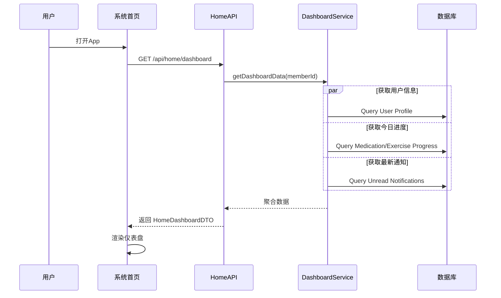
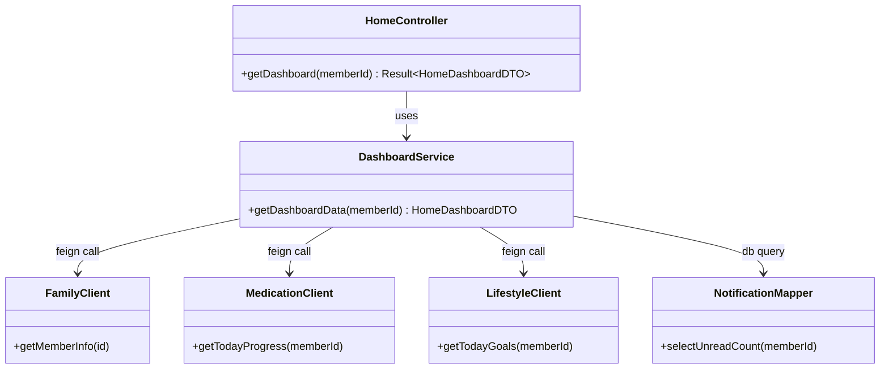
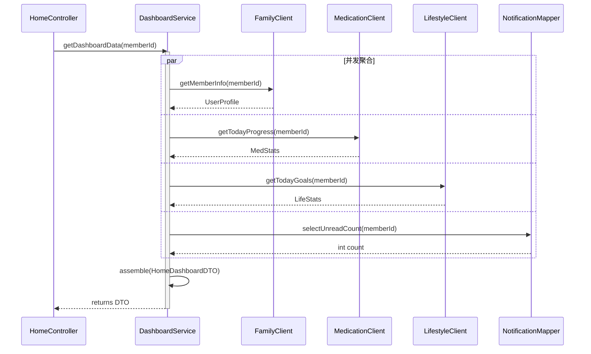

### 3.2 系统首页 (F-000)

#### 3.2.1 功能标识

- **功能ID：** F-000
- **功能名称：** 系统首页 (仪表盘)
- **英文名称：** System Home Dashboard
- **所属模块：** 基础框架
- **版本号：** v1.0

#### 3.2.2 页面原型与交互设计

**1. 系统首页**


**界面元素：**

| 元素         | 类型         | 说明                          | 交互行为                  |
| :----------- | :----------- | :---------------------------- | :------------------------ |
| 顶部问候语   | TextView     | 显示"上午好/下午好，[姓名]"   | 无                        |
| 快捷入口     | GridView     | 核心功能入口 (扫药盒、拍病历) | 点击跳转对应功能详情页    |
| 健康摘要卡片 | CardView     | 显示今日运动、服药进度        | 点击跳转生活管理/用药助手 |
| 最近动态     | RecyclerView | 显示最近的复诊提醒、报告更新  | 点击跳转对应记录详情      |
| 底部导航栏   | BottomNav    | 全局导航 (首页、档案、我的)   | 点击切换主模块            |

**主要交互 - 首页数据加载：**

*   **交互描述：** 用户打开App进入首页，系统并发拉取用户信息、今日任务进度、最近通知等数据聚合显示。
*   **涉及数据结构：** `HomeDashboardDTO`
*   **涉及数据库表：** `t_family_member`, `t_daily_goal`, `t_notification`, `t_medication_schedule`
*   **时序图：**



#### 3.2.3 功能概述

**业务价值：** 作为系统的总入口，为用户提供一站式的信息概览和快捷操作入口，帮助用户快速了解家庭健康状况并处理待办事项。

**主要用户：**
- 所有用户

#### 3.2.4 原始需求

**需求来源：** 需求规格说明书 2.3 章节

**需求描述：**
> 系统首页应包含快捷功能入口、今日健康任务概览（服药、运动）、近期重要消息提醒（复诊、报告结果）。

#### 3.2.5 正常流程

1. 用户登录 App。
2. 系统加载首页配置和数据。
3. 展示问候语和天气信息（可选）。
4. 展示快捷功能入口图标。
5. 展示今日服药和运动目标的完成进度环。
6. 展示最近的健康动态列表（如：张三的血常规报告已生成）。

#### 3.2.6 异常流程

| 异常场景 | 触发条件     | 系统行为           | 用户提示                 |
| :------- | :----------- | :----------------- | :----------------------- |
| 加载失败 | 网络异常     | 显示骨架屏或重试页 | 网络连接失败，点击重试   |
| 数据为空 | 新用户无数据 | 显示引导页         | 欢迎使用，请添加家庭成员 |

#### 3.2.7 类设计

**1. API Layer (Controller/Router)**

- **HomeController**: 首页聚合接口控制器。
  - `getDashboard()`: 处理首页数据聚合请求，并发调用 Services。
  - **Router Definition (Spring Boot Style)**:
    ```java
    @RestController
    @RequestMapping("/api/home")
    public class HomeController {
        @GetMapping("/dashboard")
        public Result<HomeDashboardDTO> getDashboard(@Min(1) @RequestParam Long memberId);
    }
    ```

**2. Service Layer**

- **DashboardService**: 核心业务类。
  - `getDashboardData(Long memberId)`: 编排获取用户信息、进度、通知的任务。
  - **Dependencies**: `FamilyService`, `MedicationService`, `LifestyleService`, `NotificationService`.

**3. Data Access Layer**

- **DailyGoalMapper**: 访问 `t_daily_goal` 表。
  - `selectByDateAndMember(LocalDate date, Long memberId)`
- **NotificationMapper**: 访问 `t_notification` 表。
  - `selectUnreadCount(Long memberId)`

**4. External Services**

- **WeatherClient**: 对接第三方天气API。
  - `getWeather(String cityCode)`

**5. Model Layer**

- **entity.DailyGoal**: 每日目标实体。
- **dto.HomeDashboardDTO**: 首页聚合数据传输对象。

**6. 静态结构图 (Class Diagram)**



**7. 类协作图 (Collaboration Diagram)**

展示 `getDashboard` 方法的内部对象协作流程。




#### 3.2.8 接口定义

**1. 获取首页仪表盘数据**

- **URL**: `/api/home/dashboard`
- **Method**: `GET`
- **Content-Type**: `application/json`

**Response Body:**

```json
{
  "code": 200,
  "data": {
    "greeting": "上午好，张三",
    "shortcuts": [
      { "id": "scan_med", "name": "扫药盒", "icon": "url..." },
      { "id": "upload_record", "name": "拍病历", "icon": "url..." }
    ],
    "todayProgress": {
      "medication": { "total": 3, "completed": 1 },
      "exercise": { "target": 6000, "current": 2500, "unit": "steps" }
    },
    "recentUpdates": [
      { "type": "REPORT", "title": "血常规报告已出", "time": "10:00", "link": "..." }
    ]
  }
}
```